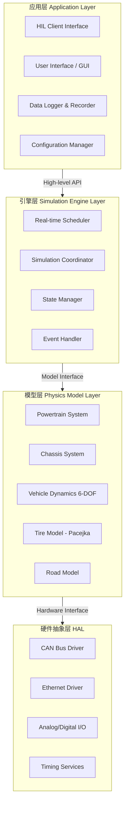
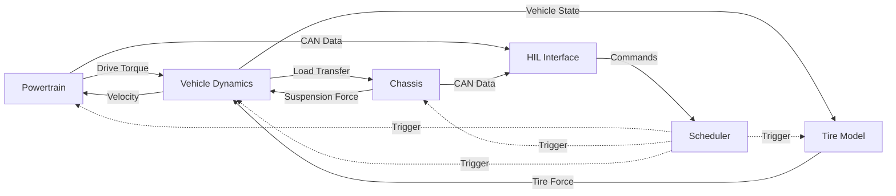
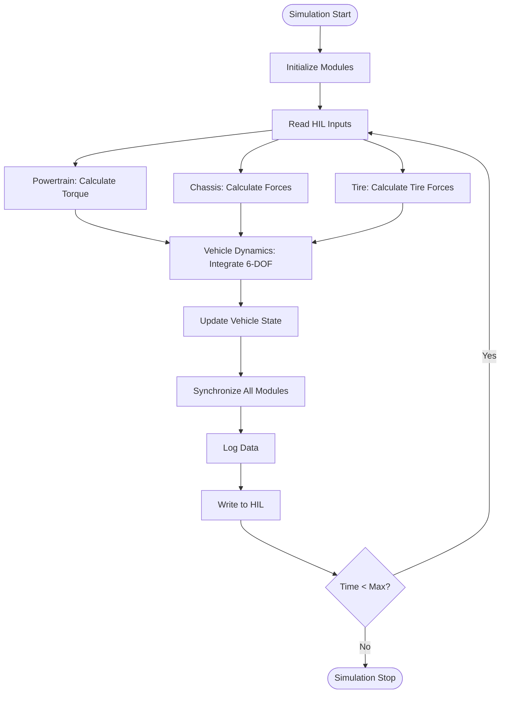
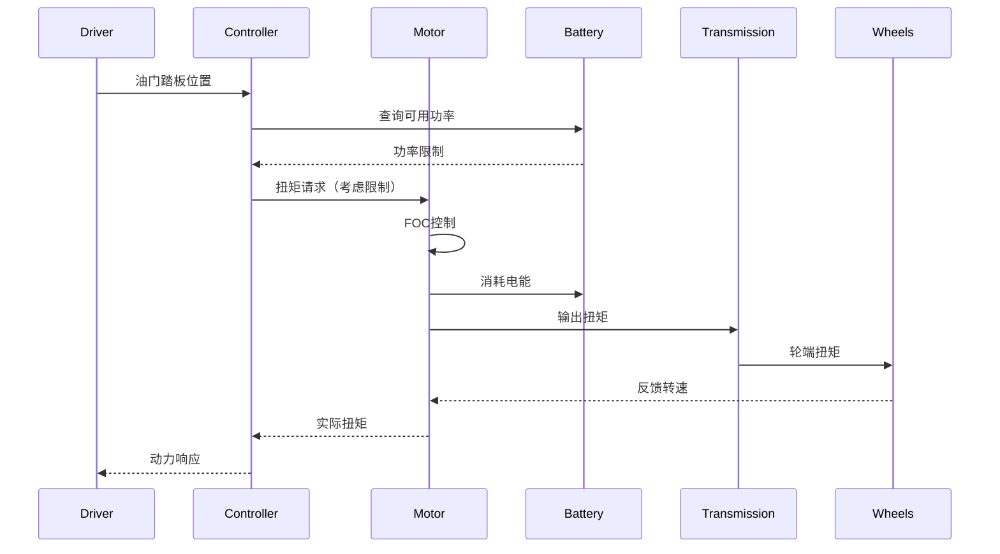

# 六自由度新能源车辆动力学仿真系统 - 系统架构设计文档

**文档版本**: v1.0  
**创建日期**: 2026-03-05  
**作者**: ArchitectAgent  
**状态**: 设计阶段

---

## 目录

1. [系统概述](#1-系统概述)
2. [整体架构](#2-整体架构)
3. [核心模块详细设计](#3-核心模块详细设计)
4. [通信机制设计](#4-通信机制设计)
5. [实时性设计](#5-实时性设计)
6. [性能优化策略](#6-性能优化策略)
7. [可扩展性设计](#7-可扩展性设计)
8. [安全性设计](#8-安全性设计)
9. [部署方案](#9-部署方案)
10. [附录](#10-附录)

---

## 1. 系统概述

### 1.1 项目背景

#### 1.1.1 行业需求

随着新能源汽车产业的快速发展，车辆动力学仿真系统在以下场景中扮演关键角色：

1. **硬件在环测试（HIL Testing）**
   - 验证电控单元（ECU）的控制算法
   - 在安全环境中测试极端工况
   - 缩短开发周期，降低测试成本

2. **自动驾驶算法验证**
   - 提供高精度的车辆动力学模型
   - 支持传感器仿真和场景重建
   - 验证决策算法的可靠性

3. **车辆性能优化**
   - 优化动力系统参数
   - 评估底盘调校方案
   - 预测车辆动态响应

#### 1.1.2 现有方案局限性

| 方案类型 | 优点 | 缺点 | 适用场景 |
|---------|------|------|---------|
| **商业软件**（CarSim、AVL Cruise） | 功能完整、精度高、技术支持 | 价格昂贵、源码不开放、定制困难 | 大型OEM、研发机构 |
| **开源方案**（OpenModelica、PyDy） | 免费、源码开放、社区支持 | 实时性差、文档不足、集成困难 | 学术研究、原型验证 |
| **自研系统** | 完全可控、可定制、成本低 | 开发周期长、需要专业知识 | 特定需求、中小企业 |

**本项目定位**：结合商业软件的可靠性和开源方案的灵活性，开发**自主可控、实时性强、模块化设计**的车辆动力学仿真系统。

### 1.2 核心目标

#### 1.2.1 功能目标

1. **6自由度车辆动力学模型**
   - 纵向运动（X轴）：加速、制动
   - 横向运动（Y轴）：转向、侧滑
   - 垂向运动（Z轴）：跳动、俯仰
   - 侧倾运动（φ）：车身侧倾
   - 俯仰运动（θ）：车身俯仰
   - 横摆运动（ψ）：转向响应

2. **新能源特性支持**
   - 电机扭矩响应特性（PMSM）
   - 电池SOC/SOH模型
   - 能量回收制动
   - 热管理系统

3. **实时HIL接口**
   - CAN总线通信（支持CAN/CAN-FD）
   - 以太网通信（UDP/TCP）
   - 模拟/数字IO接口
   - 支持主流HIL硬件（dSPACE、NI、ETAS）

#### 1.2.2 性能目标

| 性能指标 | 目标值 | 测量方法 | 验收标准 |
|---------|-------|---------|---------|
| **仿真频率** | 500Hz（默认）<br/>1000Hz（可配置） | 时间步长测量 | 连续运行1小时，频率稳定 |
| **实时延迟** | <1ms | 端到端延迟测试 | 99.9%的时间满足要求 |
| **仿真精度** | >95% | 与理论值/实测值对比 | 标准工况误差<5% |
| **内存占用** | <500MB | 系统监控 | 稳定运行不增长 |
| **CPU占用** | <70%（单核） | 系统监控 | 留有安全余量 |

#### 1.2.3 质量目标

1. **代码质量**
   - 代码覆盖率：>90%
   - 静态分析：零严重缺陷
   - 代码审查：100%覆盖

2. **文档质量**
   - 架构文档：完整详细
   - API文档：每个接口都有说明
   - 用户手册：操作指南完整

3. **测试质量**
   - 单元测试：每个模块独立测试
   - 集成测试：模块间协作测试
   - 实时性测试：延迟和抖动测试
   - 精度测试：与理论值对比

### 1.3 关键特性

#### 1.3.1 模块化设计

**设计理念**：高内聚、低耦合、易扩展

```
┌─────────────────────────────────────────┐
│          Application Layer              │
│  ┌──────────┐  ┌──────────┐  ┌────────┐│
│  │HIL Client│  │   GUI    │  │ Logger ││
│  └──────────┘  └──────────┘  └────────┘│
└─────────────────────────────────────────┘
                    ▼
┌─────────────────────────────────────────┐
│         Simulation Engine               │
│  ┌──────────┐  ┌──────────┐  ┌────────┐│
│  │Scheduler │  │Coordinator│ │  State ││
│  └──────────┘  └──────────┘  └────────┘│
└─────────────────────────────────────────┘
                    ▼
┌─────────────────────────────────────────┐
│          Physics Models                 │
│  ┌─────────┐  ┌─────────┐  ┌─────────┐ │
│  │Powertrain│  │ Chassis │  │Vehicle  │ │
│  │         │  │         │  │Dynamics │ │
│  └─────────┘  └─────────┘  └─────────┘ │
│  ┌─────────┐  ┌─────────┐              │
│  │  Tire   │  │  Road   │              │
│  │  Model  │  │  Model  │              │
│  └─────────┘  └─────────┘              │
└─────────────────────────────────────────┘
                    ▼
┌─────────────────────────────────────────┐
│   Hardware Abstraction Layer (HAL)      │
│  ┌──────────┐  ┌──────────┐  ┌────────┐│
│  │   CAN    │  │ Ethernet │  │  I/O   ││
│  │  Driver  │  │  Driver  │  │ Driver ││
│  └──────────┘  └──────────┘  └────────┘│
└─────────────────────────────────────────┘
```

**模块化优势**：
1. **独立开发**：每个模块可独立开发、测试
2. **灵活替换**：可替换任意模块而不影响其他部分
3. **易于维护**：问题定位快速，修改影响范围小
4. **支持复用**：模块可在不同项目中复用

#### 1.3.2 实时性保障

**核心技术**：

1. **PREEMPT_RT内核**
   - 全抢占式内核
   - 高精度定时器（纳秒级）
   - 优先级继承协议

2. **SCHED_FIFO调度**
   - 实时优先级调度
   - 避免时间片轮转
   - 固定优先级执行

3. **内存锁定**
   - 避免页面换出
   - 预分配内存池
   - 零拷贝传输

4. **CPU亲和性**
   - 绑定专用CPU核心
   - 避免上下文切换
   - 减少缓存失效

#### 1.3.3 高精度仿真

**数值方法**：

1. **Runge-Kutta 4阶积分（RK4）**
   - 4阶精度：O(h^4)
   - 稳定性好：适合刚性系统
   - 计算效率：每步4次函数求值

2. **自适应步长**
   - 误差估计：嵌入式RK方法
   - 步长调整：根据误差自动调整
   - 平衡精度和性能

3. **代数环处理**
   - 牛顿迭代法
   - 阻尼因子
   - 收敛判据：残差<1e-6

#### 1.3.4 混合通信机制

**设计策略**：

```
┌──────────────────────────────────────────┐
│           模块内通信（共享内存）            │
│                                          │
│  Powertrain Module                       │
│  ┌─────────┐       ┌─────────┐          │
│  │  Motor  │◄─────►│ Battery │           │
│  │ (C++)   │ Shared│ (C++)   │           │
│  └─────────┘ Memory└─────────┘          │
└──────────────────────────────────────────┘

┌──────────────────────────────────────────┐
│           模块间通信（消息队列）            │
│                                          │
│  ┌──────────┐         ┌──────────┐      │
│  │Powertrain│         │ Vehicle  │      │
│  │  Module  │─────────►│Dynamics  │      │
│  │ (Python) │ Message │ Module   │      │
│  └──────────┘ Queue   │ (Python) │      │
│                       └──────────┘      │
└──────────────────────────────────────────┘
```

**通信选择原则**：
- **模块内**：共享内存（低延迟、高吞吐）
- **模块间**：消息队列（解耦、可靠）
- **硬件接口**：DMA/中断（实时性）

---

## 2. 整体架构

### 2.1 分层架构设计

系统采用**四层架构**，每层职责明确，层间通过定义良好的接口交互。

#### 2.1.1 架构层次图



#### 2.1.2 层次职责说明

**第1层：应用层（Application Layer）**

**职责**：
- 提供用户交互界面
- 管理HIL通信
- 记录仿真数据
- 配置系统参数

**组件**：
1. **HIL Client Interface**
   - 功能：与HIL测试台通信
   - 接口：TCP/IP、UDP
   - 数据：控制命令、传感器数据

2. **User Interface**
   - 功能：参数配置、结果可视化
   - 技术：Web界面或Qt GUI
   - 特性：实时曲线显示、3D动画

3. **Data Logger**
   - 功能：记录仿真数据
   - 格式：CSV、HDF5、MDF
   - 特性：高频采样、压缩存储

4. **Configuration Manager**
   - 功能：管理系统配置
   - 格式：YAML、JSON
   - 特性：参数验证、热加载

**第2层：引擎层（Simulation Engine Layer）**

**职责**：
- 调度仿真任务
- 协调模块交互
- 管理仿真状态
- 处理同步事件

**组件**：
1. **Real-time Scheduler**
   - 功能：周期性任务调度
   - 策略：SCHED_FIFO
   - 频率：500Hz/1000Hz

2. **Simulation Coordinator**
   - 功能：协调模块执行顺序
   - 策略：拓扑排序
   - 特性：并行执行、依赖管理

3. **State Manager**
   - 功能：管理仿真状态
   - 状态：初始化、运行、暂停、停止
   - 特性：状态保存/恢复

4. **Event Handler**
   - 功能：处理异步事件
   - 事件：故障注入、参数变化
   - 特性：优先级队列

**第3层：模型层（Physics Model Layer）**

**职责**：
- 实现物理模型
- 计算动力学方程
- 更新系统状态

**组件**：
1. **Powertrain System**
   - 子模块：电机、电池、变速器
   - 输入：油门踏板、制动请求
   - 输出：驱动扭矩、车速

2. **Chassis System**
   - 子模块：悬架、转向、制动
   - 输入：转向角、制动力
   - 输出：车轮力、车身姿态

3. **Vehicle Dynamics**
   - 子模块：6-DOF运动学
   - 输入：合力、合力矩
   - 输出：位置、速度、加速度

4. **Tire Model**
   - 模型：Pacejka魔术公式
   - 输入：滑移率、垂直载荷
   - 输出：轮胎力、回正力矩

5. **Road Model**
   - 功能：道路摩擦系数、坡度
   - 输入：车辆位置
   - 输出：路面特性

**第4层：硬件抽象层（HAL）**

**职责**：
- 封装硬件接口
- 提供统一API
- 处理硬件异常

**组件**：
1. **CAN Bus Driver**
   - 功能：CAN/CAN-FD通信
   - 协议：ISO 15765、J1939
   - 特性：错误处理、总线监控

2. **Ethernet Driver**
   - 功能：UDP/TCP通信
   - 协议：XCP、CCP
   - 特性：高吞吐、低延迟

3. **Analog/Digital I/O**
   - 功能：模拟/数字信号采集
   - 接口：DAQ卡、GPIO
   - 特性：采样率可配置

4. **Timing Services**
   - 功能：高精度定时
   - 精度：纳秒级
   - 特性：硬件时钟同步

### 2.2 模块划分

#### 2.2.1 核心模块清单

| 模块编号 | 模块名称 | 主要职责 | 开发语言 | 优先级 |
|---------|---------|---------|---------|--------|
| M1 | Powertrain System | 动力系统仿真 | C++ | P0 |
| M2 | Chassis System | 底盘系统仿真 | C++ | P0 |
| M3 | Vehicle Dynamics | 6-DOF动力学 | C++ | P0 |
| M4 | Tire Model | 轮胎力学模型 | C++ | P0 |
| M5 | Real-time Scheduler | 实时调度 | C++ | P0 |
| M6 | HIL Interface | 硬件接口 | C++ | P1 |

#### 2.2.2 模块依赖关系图



**依赖说明**：
- **实线箭头**：数据依赖（需要输入数据）
- **虚线箭头**：控制依赖（触发执行）
- **双向箭头**：双向数据流

#### 2.2.3 模块执行顺序

**拓扑排序结果**（单步仿真周期内）：

1. **读取输入**（T0）
   - HIL Interface → Scheduler
   - Scheduler → 所有模块

2. **并行计算**（T0 ~ T0+0.5ms）
   - Powertrain计算驱动扭矩
   - Chassis计算悬架力
   - Tire Model计算轮胎力
   - （三个模块可并行执行）

3. **动力学积分**（T0+0.5ms ~ T0+0.8ms）
   - Vehicle Dynamics更新状态
   - （等待其他模块完成）

4. **状态同步**（T0+0.8ms ~ T0+0.9ms）
   - 各模块读取新状态
   - 准备下一步计算

5. **输出数据**（T0+0.9ms ~ T1）
   - 所有模块 → HIL Interface
   - 记录日志数据

**时间预算分配**（500Hz = 2ms周期）：

| 阶段 | 时间预算 | 实际目标 | 余量 |
|-----|---------|---------|-----|
| 输入读取 | 0.1ms | 0.05ms | 0.05ms |
| 并行计算 | 0.8ms | 0.5ms | 0.3ms |
| 动力学积分 | 0.3ms | 0.2ms | 0.1ms |
| 状态同步 | 0.1ms | 0.05ms | 0.05ms |
| 输出数据 | 0.1ms | 0.05ms | 0.05ms |
| **总计** | **1.4ms** | **0.85ms** | **0.6ms** |

**余量设计**：60%的余量用于应对：
- 系统负载波动
- 缓存失效
- 中断处理
- 未来功能扩展

### 2.3 数据流设计

#### 2.3.1 主数据流图



#### 2.3.2 数据流向详细说明

**输入数据流**（HIL → 仿真系统）：

1. **驾驶员输入**
   - 油门踏板位置（0-100%）
   - 制动踏板位置（0-100%）
   - 转向盘转角（-720° ~ +720°）
   - 档位信号（P/R/N/D）

2. **环境数据**
   - 道路摩擦系数（0-1）
   - 道路坡度（-30° ~ +30°）
   - 风速/风向

3. **故障注入**
   - 传感器故障标志
   - 执行器故障标志
   - 通信故障标志

**内部数据流**（模块间）：

1. **Powertrain → Vehicle Dynamics**
   - 驱动扭矩（N·m）
   - 再生制动力矩（N·m）
   - 动力系统转速（rpm）

2. **Chassis → Vehicle Dynamics**
   - 四轮悬架力（N）
   - 四轮悬架位移（m）
   - 转向轮转角（rad）

3. **Tire Model → Vehicle Dynamics**
   - 四轮纵向力（N）
   - 四轮侧向力（N）
   - 四轮回正力矩（N·m）

4. **Vehicle Dynamics → 所有模块**
   - 车辆位置（x, y, z）
   - 车辆速度（vx, vy, vz）
   - 车辆加速度（ax, ay, az）
   - 车身姿态（roll, pitch, yaw）
   - 角速度（ωx, ωy, ωz）

**输出数据流**（仿真系统 → HIL）：

1. **车辆状态**
   - 车速（km/h）
   - 车身姿态（°）
   - 轮速（rpm）

2. **传感器仿真**
   - 车轮转速传感器
   - 横摆角速度传感器
   - 纵向/横向加速度传感器

3. **CAN总线数据**
   - 遵循标准协议（J1939、ISO 15765）
   - 周期性发送（10ms ~ 100ms）

### 2.4 部署架构

#### 2.4.1 硬件部署方案

**方案一：单机部署（开发/测试环境）**

```
┌──────────────────────────────────────┐
│       Simulation Host (Linux)        │
│                                      │
│  ┌────────────────────────────────┐ │
│  │    Application Layer           │ │
│  └────────────────────────────────┘ │
│  ┌────────────────────────────────┐ │
│  │    Simulation Engine           │ │
│  └────────────────────────────────┘ │
│  ┌────────────────────────────────┐ │
│  │    Physics Models (C++)        │ │
│  └────────────────────────────────┘ │
│  ┌────────────────────────────────┐ │
│  │    HAL (CAN/Ethernet)          │ │
│  └────────────────────────────────┘ │
│                                      │
│  Hardware:                           │
│  - CPU: Intel i7/i9 或 AMD Ryzen 9  │
│  - RAM: 16GB DDR4                    │
│  - Storage: 500GB NVMe SSD           │
│  - Network: 千兆以太网卡              │
│  - CAN: PCAN-USB 或 Vector VN1630    │
└──────────────────────────────────────┘
         │                    │
         │ CAN Bus           │ Ethernet
         ▼                    ▼
    ┌─────────┐         ┌─────────┐
    │HIL Rack │         │Dev Host │
    │(dSPACE) │         │(GUI)    │
    └─────────┘         └─────────┘
```

**方案二：分布式部署（生产环境）**

```
┌──────────────────────────────────────────────────────────┐
│                    Real-time Cluster                      │
│                                                           │
│  ┌──────────────┐       ┌──────────────┐                │
│  │ Compute Node │       │ Compute Node │                │
│  │   #1         │       │   #2         │                │
│  │              │       │              │                │
│  │ Powertrain   │       │ Chassis      │                │
│  │ Tire Model   │       │ Vehicle Dyn  │                │
│  └──────────────┘       └──────────────┘                │
│         │                       │                        │
│         └───────┬───────────────┘                        │
│                 │                                         │
│         ┌───────▼───────┐                                │
│         │  Sync Node    │                                │
│         │  (Scheduler)  │                                │
│         └───────┬───────┘                                │
│                 │                                         │
└─────────────────┼─────────────────────────────────────────┘
                  │
         ┌────────▼────────┐
         │  I/O Gateway    │
         │  (HAL Layer)    │
         │  - CAN x 4      │
         │  - Eth x 2      │
         │  - Analog I/O   │
         └────────┬────────┘
                  │
         ┌────────▼────────┐
         │   HIL System    │
         │   (dSPACE/NI)   │
         └─────────────────┘
```

**硬件规格（生产环境）**：

| 组件 | 规格 | 数量 | 用途 |
|-----|------|-----|------|
| **计算节点** | Intel Xeon W-2295<br/>18核/36线程<br/>128GB DDR4 ECC | 2 | 物理模型计算 |
| **同步节点** | Intel Xeon E-2288G<br/>8核/16线程<br/>64GB DDR4 | 1 | 调度和同步 |
| **I/O网关** | NI PXIe-8880<br/>+ CAN模块<br/>+ DAQ模块 | 1 | 硬件接口 |
| **网络** | 10GbE交换机<br/>低延迟（<1μs） | 1 | 节点间通信 |
| **存储** | NVMe SSD RAID | 1 | 数据记录 |

#### 2.4.2 软件部署架构

**容器化部署（Docker + Kubernetes）**：

```yaml
# docker-compose.yml（开发环境）
version: '3.8'

services:
  simulation-core:
    build:
      context: ./src
      dockerfile: Dockerfile.realtime
    privileged: true  # 需要实时权限
    cpuset: "2-5"     # 绑定CPU核心
    mem_limit: 2g
    mem_reservation: 1g
    environment:
      - SIMULATION_FREQUENCY=500
      - REALTIME_PRIORITY=90
    volumes:
      - ./config:/app/config:ro
      - ./logs:/app/logs
    devices:
      - /dev/can0:/dev/can0
      - /dev/can1:/dev/can1
    networks:
      - hil-network

  hil-interface:
    build:
      context: ./src/hil_interface
      dockerfile: Dockerfile
    ports:
      - "8080:8080"   # HTTP API
      - "50000:50000" # XCP协议
    networks:
      - hil-network

  data-logger:
    build:
      context: ./src/logger
      dockerfile: Dockerfile
    volumes:
      - ./data:/app/data
    environment:
      - LOG_FORMAT=MDF
      - COMPRESSION=gzip
    networks:
      - hil-network

  gui:
    build:
      context: ./src/gui
      dockerfile: Dockerfile
    ports:
      - "3000:3000"
    networks:
      - hil-network

networks:
  hil-network:
    driver: bridge
    driver_opts:
      com.docker.network.driver.mtu: 9000  # Jumbo Frame
```

**实时性配置**（Kubernetes）：

```yaml
# realtime-pod.yaml
apiVersion: v1
kind: Pod
metadata:
  name: simulation-core
  annotations:
    # 实时调度类
    scheduling.kubernetes.io/class: realtime
    # CPU亲和性
    cpu-manager.kubernetes.io/static: "true"
spec:
  containers:
  - name: simulation
    image: ev-simulation:latest
    resources:
      limits:
        cpu: "4"
        memory: "2Gi"
        hugepages-2Mi: "512Mi"
      requests:
        cpu: "4"
        memory: "1Gi"
        hugepages-2Mi: "512Mi"
    # 实时调度配置
    securityContext:
      capabilities:
        add:
          - SYS_NICE  # 允许设置实时优先级
          - IPC_LOCK  # 允许内存锁定
    volumeMounts:
    - name: hugepages
      mountPath: /hugepages
  volumes:
  - name: hugepages
    emptyDir:
      medium: HugePages
  # CPU亲和性（独占CPU核心）
  affinity:
    nodeAffinity:
      requiredDuringSchedulingIgnoredDuringExecution:
        nodeSelectorTerms:
        - matchExpressions:
          - key: realtime
            operator: In
            values:
            - "true"
```

---

## 3. 核心模块详细设计

### 3.1 动力系统模块（Powertrain System）

#### 3.1.1 模块概述

**职责**：仿真电动汽车动力系统的动态行为

**子模块**：
1. 电机模型（Electric Motor）
2. 电池模型（Battery Pack）
3. 变速器模型（Transmission）
4. 动力系统控制器（Powertrain Controller）

**关键特性**：
- PMSM电机的高精度模型
- 电池SOC/SOH动态估算
- 能量回收制动仿真
- 热管理系统简化模型

#### 3.1.2 电机模型（PMSM）

**物理模型**：

永磁同步电机（PMSM）的数学模型：

**dq坐标系下的电压方程**：

```
u_d = R_s * i_d + dψ_d/dt - ω_e * ψ_q
u_q = R_s * i_q + dψ_q/dt + ω_e * ψ_d

其中：
ψ_d = L_d * i_d + ψ_f
ψ_q = L_q * i_q
```

**电磁转矩**：

```
T_e = (3/2) * p * [ψ_f * i_q + (L_d - L_q) * i_d * i_q]
```

**运动方程**：

```
J * dω/dt = T_e - T_L - B * ω
```

**参数表**：

| 参数 | 符号 | 典型值 | 单位 | 说明 |
|-----|------|-------|-----|------|
| 定子电阻 | R_s | 0.02 | Ω | 铜损 |
| d轴电感 | L_d | 0.0002 | H | 凸极效应 |
| q轴电感 | L_q | 0.0003 | H | 凸极效应 |
| 永磁体磁链 | ψ_f | 0.1 | Wb | 稀土永磁 |
| 极对数 | p | 4 | - | 8极电机 |
| 转动惯量 | J | 0.05 | kg·m² | 转子+负载 |
| 阻尼系数 | B | 0.001 | N·m·s/rad | 机械损耗 |

**实现架构**：

```cpp
// motor_model.h
class PMSMMotor {
public:
    // 构造函数
    PMSMMotor(const MotorConfig& config);
    
    // 主接口
    void setTorqueRequest(double torque_nm);  // 设置扭矩请求
    void update(double dt);                    // 更新状态（每个时间步）
    
    // 状态查询
    MotorState getState() const;
    double getActualTorque() const { return state_.torque_actual; }
    double getRotorSpeed() const { return state_.rotor_speed; }
    double getMotorTemperature() const { return state_.temperature; }
    
    // 诊断接口
    bool isOverloaded() const;
    bool isOverheated() const;
    
private:
    // 内部计算方法
    void calculateElectricalDynamics(double dt);
    void calculateThermalDynamics(double dt);
    void applyTorqueLimit();
    
    // 参数
    MotorConfig config_;
    
    // 状态
    MotorState state_;
    
    // 控制器（FOC）
    FieldOrientedController foc_controller_;
};
```

**关键算法：磁场定向控制（FOC）**

```cpp
// foc_controller.cpp
void FieldOrientedController::update(double torque_request, 
                                      double rotor_speed,
                                      double dt) {
    // 1. 计算目标电流
    double i_q_target = torque_request / (1.5 * config_.pole_pairs * config_.flux_linkage);
    double i_d_target = 0.0;  // 最大转矩电流比控制（MTPA）
    
    // 2. 弱磁控制（高速工况）
    if (rotor_speed > config_.base_speed) {
        double back_emf = rotor_speed * config_.flux_linkage;
        if (back_emf > config_.max_voltage * 0.9) {
            // 弱磁：负d轴电流
            i_d_target = -sqrt((back_emf / config_.max_voltage) - 1) * config_.max_current;
        }
    }
    
    // 3. 电流限制（圆限制）
    double i_total = sqrt(i_d_target * i_d_target + i_q_target * i_q_target);
    if (i_total > config_.max_current) {
        double scale = config_.max_current / i_total;
        i_d_target *= scale;
        i_q_target *= scale;
    }
    
    // 4. 电流环PI控制
    double i_d_error = i_d_target - state_.i_d;
    double i_q_error = i_q_target - state_.i_q;
    
    state_.v_d = pi_controller_d_.update(i_d_error, dt);
    state_.v_q = pi_controller_q_.update(i_q_error, dt);
    
    // 5. 反Park变换（dq -> abc）
    double theta = state_.rotor_angle;
    double v_alpha = state_.v_d * cos(theta) - state_.v_q * sin(theta);
    double v_beta  = state_.v_d * sin(theta) + state_.v_q * cos(theta);
    
    // 6. SVPWM调制
    svpwm_modulator_.update(v_alpha, v_beta, config_.dc_bus_voltage);
}
```

**实时性优化**：

1. **查表法（Lookup Table）**
   - 预计算MTPA轨迹
   - 预计算效率MAP
   - 减少 transcendental 函数调用

2. **定点数运算**
   - 非关键路径使用定点数
   - 避免浮点除法
   - 使用移位代替乘除

3. **内存预分配**
   - 所有数组静态分配
   - 避免动态内存分配
   - 使用内存池

#### 3.1.3 电池模型（Battery Pack）

**物理模型**：等效电路模型（Thevenin模型）

```
        R_s          R_p
    ───/\/\/\──┬──/\/\/\──┐
   +           │          │
   │          ─┴─ C_p     │
  V_oc        ─┬─         │
   │           │          │
   ────────────┴──────────┘
```

**数学方程**：

```
V_terminal = V_oc(SOC) - I * R_s - V_p

dV_p/dt = (I * R_p - V_p) / (R_p * C_p)

SOC(t) = SOC(0) - (1/Q_nom) * ∫I(t)dt
```

**参数表**：

| 参数 | 符号 | 典型值 | 单位 | 说明 |
|-----|------|-------|-----|------|
| 开路电压 | V_oc | 300-400 | V | SOC相关 |
| 串联电阻 | R_s | 0.05 | Ω | 欧姆极化 |
| 极化电阻 | R_p | 0.02 | Ω | 电化学极化 |
| 极化电容 | C_p | 1000 | F | 双电层效应 |
| 额定容量 | Q_nom | 100 | kWh | 可用能量 |

**SOC估算算法**：扩展卡尔曼滤波（EKF）

```cpp
// battery_model.cpp
class BatteryPack {
public:
    void update(double power_request, double dt) {
        // 1. 计算电流
        double current = power_request / state_.voltage;
        
        // 2. 更新极化电压
        double tau = config_.r_polarization * config_.c_polarization;
        double v_p_new = state_.v_polarization + 
                         dt / tau * (current * config_.r_polarization - state_.v_polarization);
        state_.v_polarization = v_p_new;
        
        // 3. 计算端电压
        double v_oc = lookupOpenCircuitVoltage(state_.soc);
        state_.voltage = v_oc - current * config_.r_series - state_.v_polarization;
        
        // 4. 更新SOC（安时积分 + EKF校正）
        double soc_ah = state_.soc - current * dt / (config_.nominal_capacity * 3600);
        state_.soc = ekf_estimator_.update(soc_ah, state_.voltage);
        
        // 5. 更新温度
        updateTemperature(current, dt);
        
        // 6. 更新SOH
        updateSOH();
    }
    
private:
    double lookupOpenCircuitVoltage(double soc) {
        // 8阶多项式拟合
        // V_oc = a0 + a1*SOC + a2*SOC^2 + ... + a8*SOC^8
        double v = config_.voc_coefficients[0];
        double soc_power = 1.0;
        for (int i = 1; i <= 8; i++) {
            soc_power *= soc;
            v += config_.voc_coefficients[i] * soc_power;
        }
        return v;
    }
    
    void updateTemperature(double current, double dt) {
        // 热模型：Q_gen = I^2 * R
        double heat_generation = current * current * config_.r_series;
        double heat_dissipation = (state_.temperature - ambient_temperature_) / config_.thermal_resistance;
        
        double dT = (heat_generation - heat_dissipation) * dt / config_.thermal_capacity;
        state_.temperature += dT;
    }
};
```

**电池管理系统（BMS）逻辑**：

```cpp
class BatteryManagementSystem {
public:
    void update(const BatteryState& state) {
        // 1. 过充/过放保护
        if (state.soc > 0.95) {
            limit_charging_ = true;
        } else if (state.soc < 0.10) {
            limit_discharging_ = true;
        }
        
        // 2. 温度保护
        if (state.temperature > config_.max_temperature) {
            derate_power_ = true;
            power_limit_ = calculateThermalDerate(state.temperature);
        }
        
        // 3. 电压平衡
        if (detectCellImbalance(state.cell_voltages)) {
            activate_balancing_ = true;
        }
        
        // 4. SOH估算
        if (state.cycle_count > config_.calibration_interval) {
            calibrateSOH();
        }
    }
    
    PowerLimits getPowerLimits() const {
        return {
            .max_charge_power = limit_charging_ ? 0 : config_.max_charge_power,
            .max_discharge_power = limit_discharging_ ? 0 : 
                                   derate_power_ ? power_limit_ : config_.max_discharge_power,
            .max_regen_power = config_.max_regen_power
        };
    }
};
```

#### 3.1.4 变速器模型（Transmission）

**电动汽车变速器特点**：
- 单速减速器为主流
- 固定传动比
- 机械效率高（>95%）

**数学模型**：

```
T_wheel = T_motor * gear_ratio * efficiency
ω_motor = ω_wheel * gear_ratio
```

**参数**：

| 参数 | 符号 | 典型值 | 单位 | 说明 |
|-----|------|-------|-----|------|
| 传动比 | i_g | 9.73 | - | 减速比 |
| 机械效率 | η | 0.96 | - | 齿轮传动效率 |
| 主减速比 | i_0 | 1 | - | 无主减速 |

**实现**：

```cpp
class SingleSpeedTransmission {
public:
    WheelTorque calculateWheelTorque(double motor_torque) {
        return {
            .torque = motor_torque * config_.gear_ratio * config_.efficiency,
            .speed = state_.motor_speed / config_.gear_ratio
        };
    }
    
    MotorSpeed calculateMotorSpeed(double wheel_speed) {
        return wheel_speed * config_.gear_ratio;
    }
    
private:
    TransmissionConfig config_;
    TransmissionState state_;
};
```

#### 3.1.5 动力系统集成

**模块间协作流程**：



**集成代码示例**：

```cpp
// powertrain_system.cpp
class PowertrainSystem {
public:
    void update(double throttle_position, double brake_position, double dt) {
        // 1. 解析驾驶员意图
        double torque_request = parseDriverIntent(throttle_position, brake_position);
        
        // 2. 电池功率限制
        auto power_limits = battery_.getPowerLimits();
        double max_torque = power_limits.max_discharge_power / 
                           (motor_.getRotorSpeed() * 2 * M_PI / 60);
        
        // 3. 应用扭矩限制
        torque_request = std::clamp(torque_request, -power_limits.max_regen_torque, max_torque);
        
        // 4. 电机控制
        motor_.setTorqueRequest(torque_request);
        motor_.update(dt);
        
        // 5. 电池消耗
        double power = motor_.getActualTorque() * motor_.getRotorSpeed() * 2 * M_PI / 60;
        battery_.update(power, dt);
        
        // 6. 变速器
        auto wheel_torque = transmission_.calculateWheelTorque(motor_.getActualTorque());
        
        // 7. 输出到车辆动力学
        output_.drive_torque = wheel_torque.torque;
        output_.motor_speed = motor_.getRotorSpeed();
        output_.battery_soc = battery_.getSOC();
    }
    
private:
    PMSMMotor motor_;
    BatteryPack battery_;
    SingleSpeedTransmission transmission_;
    PowertrainOutput output_;
    
    double parseDriverIntent(double throttle, double brake) {
        // 踏板映射：非线性曲线
        double max_motor_torque = config_.max_motor_torque;
        
        if (brake > 0.1) {
            // 制动优先
            return -max_motor_torque * brake * config_.regen_brake_ratio;
        } else {
            // 驱动
            return max_motor_torque * throttle_map_[static_cast<int>(throttle * 100)];
        }
    }
};
```

---

### 3.2 底盘系统模块（Chassis System）

#### 3.2.1 模块概述

**职责**：仿真车辆底盘系统的动态行为

**子模块**：
1. 悬架系统（Suspension）
2. 转向系统（Steering）
3. 制动系统（Braking）

**关键特性**：
- 主动/被动悬架支持
- 电动助力转向（EPS）/线控转向（SBW）
- 电子机械制动（EMB）

#### 3.2.2 悬架模型（Suspension）

**物理模型**：四分之一车辆模型（扩展到四轮）

```
         M_s (簧上质量)
          │
          ├─ K_s (弹簧刚度)
          │
          ├─ C_s (阻尼系数)
          │
          │
    ──────┴──────  M_u (簧下质量)
          │
          ├─ K_t (轮胎刚度)
          │
    ══════╧══════  路面输入
```

**数学方程**：

```
M_s * z̈_s = -K_s * (z_s - z_u) - C_s * (ż_s - ż_u) + F_active

M_u * z̈_u = K_s * (z_s - z_u) + C_s * (ż_s - ż_u) - K_t * (z_u - z_r) - F_active
```

**参数表**（单轮）：

| 参数 | 符号 | 前轮值 | 后轮值 | 单位 | 说明 |
|-----|------|-------|-------|-----|------|
| 簧上质量 | M_s | 400 | 350 | kg | 车身质量分配 |
| 簧下质量 | M_u | 40 | 35 | kg | 车轮+悬架 |
| 弹簧刚度 | K_s | 25000 | 22000 | N/m | 螺旋弹簧 |
| 阻尼系数 | C_s | 2500 | 2200 | N·s/m | 减振器 |
| 轮胎刚度 | K_t | 200000 | 200000 | N/m | 径向刚度 |

**主动悬架控制**：

```cpp
class ActiveSuspension {
public:
    void update(double road_input, double dt) {
        // 1. 计算相对位移和速度
        double z_rel = state_.z_s - state_.z_u;
        double z_rel_dot = state_.z_s_dot - state_.z_u_dot;
        
        // 2. 天棚阻尼控制（Skyhook）
        double f_skyhook = -config_.c_skyhook * state_.z_s_dot;
        
        // 3. 地钩阻尼控制（Groundhook）
        double f_groundhook = -config_.c_groundhook * state_.z_u_dot;
        
        // 4. 综合控制力
        double f_control = alpha_ * f_skyhook + (1 - alpha_) * f_groundhook;
        
        // 5. 执行器限制
        f_control = std::clamp(f_control, -config_.max_actuator_force, config_.max_actuator_force);
        
        // 6. 更新状态（RK4积分）
        integrateRK4(road_input, f_control, dt);
        
        // 7. 计算悬架力（输出到车身）
        output_.suspension_force = -config_.k_spring * z_rel - config_.c_damper * z_rel_dot + f_control;
    }
    
private:
    void integrateRK4(double road_input, double f_control, double dt) {
        // RK4积分实现（略）
        // 状态向量: [z_s, z_s_dot, z_u, z_u_dot]
    }
    
    SuspensionConfig config_;
    SuspensionState state_;
    SuspensionOutput output_;
    
    double alpha_ = 0.6;  // 天棚阻尼权重
};
```

**四轮悬架集成**：

```cpp
class FourWheelSuspension {
public:
    void update(const RoadInputs& road_inputs, const LoadTransfer& load, double dt) {
        // 1. 更新各轮悬架
        suspensions_[FRONT_LEFT].update(road_inputs.front_left, dt);
        suspensions_[FRONT_RIGHT].update(road_inputs.front_right, dt);
        suspensions_[REAR_LEFT].update(road_inputs.rear_left, dt);
        suspensions_[REAR_RIGHT].update(road_inputs.rear_right, dt);
        
        // 2. 计算载荷转移
        double delta_z_roll = load.lateral_accel * config_.roll_center_height / config_.track_width;
        double delta_z_pitch = load.longitudinal_accel * config_.pitch_center_height / config_.wheelbase;
        
        // 3. 应用载荷转移
        suspensions_[FRONT_LEFT].applyLoadTransfer(delta_z_roll - delta_z_pitch);
        suspensions_[FRONT_RIGHT].applyLoadTransfer(-delta_z_roll - delta_z_pitch);
        suspensions_[REAR_LEFT].applyLoadTransfer(delta_z_roll + delta_z_pitch);
        suspensions_[REAR_RIGHT].applyLoadTransfer(-delta_z_roll + delta_z_pitch);
        
        // 4. 计算总悬架力
        output_.total_force_x = 0;
        output_.total_force_z = suspensions_[0].getForce() + suspensions_[1].getForce() +
                                suspensions_[2].getForce() + suspensions_[3].getForce();
    }
    
private:
    std::array<ActiveSuspension, 4> suspensions_;
};
```

#### 3.2.3 转向模型（Steering）

**系统类型**：
1. 电动助力转向（EPS）
2. 线控转向（SBW）

**EPS模型**：

```
转向盘 → 转向柱 → 扭矩传感器 → ECU → 电机 → 助力 → 转向器 → 车轮
```

**数学模型**：

```
J_sw * δ̈_sw = T_driver - T_damper - T_self_align - T_assist
T_assist = K_assist * T_sensor
δ_wheel = δ_sw / i_steering
```

**参数表**：

| 参数 | 符号 | 典型值 | 单位 | 说明 |
|-----|------|-------|-----|------|
| 转向盘转动惯量 | J_sw | 0.05 | kg·m² | 含转向柱 |
| 转向传动比 | i_steering | 16 | - | 转向盘:车轮 |
| 助力增益 | K_assist | 2.5 | - | 速敏感 |
| 阻尼系数 | C_damper | 0.3 | N·m·s/rad | 转向阻尼 |

**实现**：

```cpp
class ElectricPowerSteering {
public:
    void update(double steering_wheel_angle, double vehicle_speed, double dt) {
        // 1. 计算驾驶员扭矩
        double driver_torque = steering_wheel_angle * config_.steering_stiffness;
        
        // 2. 计算回正力矩（来自轮胎）
        double self_align_torque = tire_model_->getAligningTorque();
        
        // 3. 计算助力扭矩（速敏感）
        double assist_gain = calculateAssistGain(vehicle_speed);
        double assist_torque = assist_gain * (driver_torque - self_align_torque);
        
        // 4. 应用扭矩限制
        assist_torque = std::clamp(assist_torque, -config_.max_assist_torque, config_.max_assist_torque);
        
        // 5. 计算车轮转角
        state_.wheel_angle = steering_wheel_angle / config_.steering_ratio;
        
        // 6. 输出
        output_.steering_wheel_torque = driver_torque + assist_torque - self_align_torque;
        output_.front_wheel_angle = state_.wheel_angle;
    }
    
private:
    double calculateAssistGain(double speed) {
        // 低速大助力，高速小助力
        if (speed < 10.0) {
            return config_.max_assist_gain;
        } else if (speed > 100.0) {
            return config_.min_assist_gain;
        } else {
            return config_.max_assist_gain - 
                   (speed - 10.0) / 90.0 * (config_.max_assist_gain - config_.min_assist_gain);
        }
    }
};
```

#### 3.2.4 制动模型（Braking）

**系统类型**：
1. 液压制动（传统）
2. 电子机械制动（EMB）

**EMB模型**：

```
制动踏板 → 制动控制器 → 电机 → 丝杠 → 制动钳 → 制动盘
```

**数学模型**：

```
T_brake = μ_brake * F_clamp * r_effective * n_pads
F_clamp = T_motor * screw_ratio * efficiency
```

**参数表**：

| 参数 | 符号 | 典型值 | 单位 | 说明 |
|-----|------|-------|-----|------|
| 制动盘摩擦系数 | μ_brake | 0.4 | - | 铸铁盘 |
| 有效半径 | r_effective | 0.15 | m | 制动盘半径 |
| 制动钳活塞数 | n_pads | 2 | - | 对置活塞 |
| 丝杠传动比 | screw_ratio | 5000 | N/N·m | 推力/扭矩 |
| 最大夹紧力 | F_max | 25000 | N | 单轮 |

**制动分配策略（EBD）**：

```cpp
class ElectronicBrakeForceDistribution {
public:
    BrakeForces calculate(double brake_request, const VehicleState& vehicle_state) {
        // 1. 计算总制动力
        double total_brake_force = brake_request * config_.max_total_brake_force;
        
        // 2. 理想制动力分配（基于载荷转移）
        double static_front_ratio = 0.6;
        double dynamic_factor = vehicle_state.longitudinal_accel / config_.max_decel;
        double front_ratio = static_front_ratio + 0.1 * dynamic_factor;
        
        // 3. 前后制动力分配
        double front_brake = total_brake_force * front_ratio;
        double rear_brake = total_brake_force * (1 - front_ratio);
        
        // 4. 左右制动力分配（横向载荷转移）
        double left_ratio = 0.5 - vehicle_state.lateral_accel / config_.max_lateral_accel * 0.1;
        double right_ratio = 1.0 - left_ratio;
        
        return {
            .front_left = front_brake / 2 * left_ratio * 2,
            .front_right = front_brake / 2 * right_ratio * 2,
            .rear_left = rear_brake / 2 * left_ratio * 2,
            .rear_right = rear_brake / 2 * right_ratio * 2
        };
    }
};
```

#### 3.2.5 底盘系统集成

```cpp
class ChassisSystem {
public:
    void update(const ChassisInput& input, double dt) {
        // 1. 悬架系统
        RoadInputs road_inputs = roadModel_->getRoadInputs(state_.position);
        suspension_.update(road_inputs, state_.load_transfer, dt);
        
        // 2. 转向系统
        steering_.update(input.steering_wheel_angle, state_.velocity, dt);
        
        // 3. 制动系统
        auto brake_forces = brake_distribution_.calculate(input.brake_pedal, state_);
        
        // 4. 输出
        output_.suspension_forces = suspension_.getForces();
        output_.front_wheel_angle = steering_.getFrontWheelAngle();
        output_.brake_torques = convertForceToTorque(brake_forces);
    }
    
private:
    FourWheelSuspension suspension_;
    ElectricPowerSteering steering_;
    ElectronicBrakeForceDistribution brake_distribution_;
    std::shared_ptr<RoadModel> road_model_;
};
```

---

### 3.3 车辆动力学模块（Vehicle Dynamics 6-DOF）

#### 3.3.1 模块概述

**职责**：仿真车辆的6自由度运动

**自由度定义**：
1. 纵向运动（X轴）：平移
2. 横向运动（Y轴）：平移
3. 垂向运动（Z轴）：平移
4. 侧倾运动（φ）：绕X轴旋转
5. 俯仰运动（θ）：绕Y轴旋转
6. 横摆运动（ψ）：绕Z轴旋转

#### 3.3.2 坐标系定义

**坐标系系统**：
1. **惯性坐标系（Earth-Fixed）**：{E} - X_E, Y_E, Z_E
2. **车身坐标系（Body-Fixed）**：{B} - X_B, Y_B, Z_B
3. **轮胎坐标系（Wheel-Fixed）**：{W} - X_W, Y_W, Z_W

**坐标系关系**：

```
           Z_E
            │
            │
            │      X_B (纵向)
            │     ╱
            │    ╱
            │   ╱  Y_B (横向)
            │  ╱
            │ ╱
            ╱─────────── Y_E
           ╱
          ╱
        X_E
```

**欧拉角（ZYX顺序）**：

```
R = R_z(ψ) * R_y(θ) * R_x(φ)
```

#### 3.3.3 6自由度运动方程

**牛顿-欧拉方程**：

**平动方程**（车身坐标系）：

```
m * (v̇ + ω × v) = F_external

展开：
m * (ẟv_x - v_y * ω_z + v_z * ω_y) = F_x
m * (ẟv_y - v_z * ω_x + v_x * ω_z) = F_y
m * (ẟv_z - v_x * ω_y + v_y * ω_x) = F_z
```

**转动方程**（车身坐标系）：

```
I * ω̇ + ω × (I * ω) = M_external

展开：
I_xx * ω̇_x - (I_yy - I_zz) * ω_y * ω_z = M_x  (侧倾)
I_yy * ω̇_y - (I_zz - I_xx) * ω_z * ω_x = M_y  (俯仰)
I_zz * ω̇_z - (I_xx - I_yy) * ω_x * ω_y = M_z  (横摆)
```

**外力计算**：

```
F_x = F_xaero + ΣF_x_tire + F_x_grade
F_y = ΣF_y_tire
F_z = ΣF_z_suspension + F_z_aero

M_x = Σ(F_z_suspension * y_i) - Σ(F_y_tire * z_i)  (侧倾力矩)
M_y = Σ(F_z_suspension * x_i) - Σ(F_x_tire * z_i)  (俯仰力矩)
M_z = Σ(F_y_tire * x_i) - Σ(F_x_tire * y_i)        (横摆力矩)
```

**参数表**：

| 参数 | 符号 | 典型值 | 单位 | 说明 |
|-----|------|-------|-----|------|
| 整车质量 | m | 2000 | kg | 含乘员 |
| 质心高度 | h_cg | 0.5 | m | 离地高度 |
| 绕X轴转动惯量 | I_xx | 500 | kg·m² | 侧倾 |
| 绕Y轴转动惯量 | I_yy | 2500 | kg·m² | 俯仰 |
| 绕Z轴转动惯量 | I_zz | 2800 | kg·m² | 横摆 |
| 轴距 | L | 2.8 | m | 前后轴距离 |
| 轮距 | W | 1.6 | m | 左右轮距离 |

#### 3.3.4 数值积分方法

**Runge-Kutta 4阶（RK4）**：

```
y_{n+1} = y_n + (h/6) * (k1 + 2*k2 + 2*k3 + k4)

其中：
k1 = f(t_n, y_n)
k2 = f(t_n + h/2, y_n + h/2 * k1)
k3 = f(t_n + h/2, y_n + h/2 * k2)
k4 = f(t_n + h, y_n + h * k3)
```

**状态向量**：

```
X = [x, y, z, φ, θ, ψ, v_x, v_y, v_z, ω_x, ω_y, ω_z]^T  (12维)
```

**实现**：

```cpp
// vehicle_dynamics.cpp
class VehicleDynamics6DOF {
public:
    void update(const DynamicsInput& input, double dt) {
        // RK4积分
        StateVector k1 = computeDerivative(state_, input);
        StateVector k2 = computeDerivative(state_ + dt/2 * k1, input);
        StateVector k3 = computeDerivative(state_ + dt/2 * k2, input);
        StateVector k4 = computeDerivative(state_ + dt * k3, input);
        
        state_ = state_ + dt/6 * (k1 + 2*k2 + 2*k3 + k4);
        
        // 归一化欧拉角
        normalizeEulerAngles();
    }
    
private:
    StateVector computeDerivative(const StateVector& state, const DynamicsInput& input) {
        StateVector derivative;
        
        // 1. 位置导数（需要坐标变换）
        Eigen::Matrix3d R = eulerToRotationMatrix(state.phi, state.theta, state.psi);
        Eigen::Vector3d v_body(state.v_x, state.v_y, state.v_z);
        Eigen::Vector3d v_earth = R * v_body;
        
        derivative.x = v_earth(0);
        derivative.y = v_earth(1);
        derivative.z = v_earth(2);
        
        // 2. 欧拉角导数
        Eigen::Vector3d omega(state.omega_x, state.omega_y, state.omega_z);
        Eigen::Vector3d euler_dot = eulerRates(state.phi, state.theta, omega);
        
        derivative.phi = euler_dot(0);
        derivative.theta = euler_dot(1);
        derivative.psi = euler_dot(2);
        
        // 3. 速度导数（牛顿方程）
        double F_x = input.aero_force_x + input.total_tire_force_x + input.grade_force_x;
        double F_y = input.total_tire_force_y;
        double F_z = input.total_suspension_force_z + input.aero_force_z;
        
        derivative.v_x = F_x / mass_ + state.v_y * state.omega_z - state.v_z * state.omega_y;
        derivative.v_y = F_y / mass_ + state.v_z * state.omega_x - state.v_x * state.omega_z;
        derivative.v_z = F_z / mass_ + state.v_x * state.omega_y - state.v_y * state.omega_x;
        
        // 4. 角速度导数（欧拉方程）
        double M_x = computeRollMoment(input);
        double M_y = computePitchMoment(input);
        double M_z = computeYawMoment(input);
        
        derivative.omega_x = (M_x - (I_yy_ - I_zz_) * state.omega_y * state.omega_z) / I_xx_;
        derivative.omega_y = (M_y - (I_zz_ - I_xx_) * state.omega_z * state.omega_x) / I_yy_;
        derivative.omega_z = (M_z - (I_xx_ - I_yy_) * state.omega_x * state.omega_y) / I_zz_;
        
        return derivative;
    }
    
    double computeRollMoment(const DynamicsInput& input) {
        // 侧倾力矩：悬架力 + 轮胎力
        double M_suspension = 0;
        for (int i = 0; i < 4; i++) {
            M_suspension += input.suspension_forces[i].z * wheel_positions_[i].y;
        }
        
        double M_tire = 0;
        for (int i = 0; i < 4; i++) {
            M_tire -= input.tire_forces[i].y * cg_height_;
        }
        
        return M_suspension + M_tire;
    }
    
    StateVector state_;
    VehicleParams params_;
};
```

#### 3.3.5 载荷转移计算

**静态载荷**：

```
F_z_fl_static = m * g * (L_r / L) * (W_r / W) / 2
F_z_fr_static = m * g * (L_r / L) * (W_l / W) / 2
F_z_rl_static = m * g * (L_f / L) * (W_r / W) / 2
F_z_rr_static = m * g * (L_f / L) * (W_l / W) / 2
```

**动态载荷转移**：

```
ΔF_z_longitudinal = m * a_x * h_cg / L  (制动/加速)
ΔF_z_lateral = m * a_y * h_cg / W       (转向)
```

**总垂直载荷**：

```
F_z_fl = F_z_fl_static - ΔF_z_longitudinal/2 + ΔF_z_lateral/2
F_z_fr = F_z_fr_static - ΔF_z_longitudinal/2 - ΔF_z_lateral/2
F_z_rl = F_z_rl_static + ΔF_z_longitudinal/2 + ΔF_z_lateral/2
F_z_rr = F_z_rr_static + ΔF_z_longitudinal/2 - ΔF_z_lateral/2
```

---

### 3.4 轮胎模型模块（Tire Model - Pacejka）

#### 3.4.1 模块概述

**职责**：计算轮胎与路面之间的相互作用力

**模型选择**：Pacejka魔术公式（Magic Formula）

**特点**：
- 半经验模型
- 精度高（误差<5%）
- 参数可辨识
- 计算效率高

#### 3.4.2 Pacejka魔术公式

**基本形式**：

```
Y(x) = D * sin(C * arctan(B * x - E * (B * x - arctan(B * x))))
```

**参数说明**：

| 参数 | 符号 | 物理意义 | 典型值范围 |
|-----|------|---------|-----------|
| 刚度因子 | B | 曲线原点斜率 | 4-12 |
| 形状因子 | C | 曲线形状 | 1.2-2.5 |
| 峰值因子 | D | 最大值 | F_z依赖 |
| 曲率因子 | E | 曲线曲率 | -2 ~ 2 |

#### 3.4.3 纵向力（纯纵滑）

**滑移率定义**：

```
κ = (V_wheel - V_vehicle) / V_vehicle
  = (ω_wheel * R_e - v_x) / v_x
```

**纵向力公式**：

```
F_x0(κ) = D_x * sin(C_x * arctan(B_x * κ - E_x * (B_x * κ - arctan(B_x * κ))))

其中：
D_x = μ_x * F_z
B_x = B_x0 / (C_x * D_x)
```

**参数表**：

| 参数 | 干沥青 | 湿沥青 | 雪地 | 冰面 |
|-----|-------|-------|-----|-----|
| μ_x (峰值附着) | 1.0 | 0.7 | 0.3 | 0.1 |
| B_x | 10.0 | 8.0 | 5.0 | 3.0 |
| C_x | 1.65 | 1.65 | 1.65 | 1.65 |
| E_x | 0.97 | 0.97 | 0.97 | 0.97 |

#### 3.4.4 侧向力（纯侧偏）

**侧偏角定义**：

```
α = arctan(v_y / v_x)
```

**侧向力公式**：

```
F_y0(α) = D_y * sin(C_y * arctan(B_y * α - E_y * (B_y * α - arctan(B_y * α))))

其中：
D_y = μ_y * F_z
B_y = B_y0 / (C_y * D_y)
```

#### 3.4.5 组合滑移（纵滑+侧偏）

**摩擦椭圆方法**：

```
F_x = F_x0(κ) * cos(θ)
F_y = F_y0(α) * sin(θ)

其中：
θ = arctan(α / κ)
```

**或使用归一化方法**：

```
σ_x = κ / κ_max
σ_y = α / α_max
σ = sqrt(σ_x^2 + σ_y^2)

F_x = F_x0(κ) * σ_x / σ
F_y = F_y0(α) * σ_y / σ
```

#### 3.4.6 回正力矩

**公式**：

```
M_z = -t * F_y + M_zr

其中：
t = (D_t + D_tz * F_z) * sin(C_t * arctan(B_t * α))  (轮胎拖距)
M_zr = D_r * sin(C_r * arctan(B_r * α))              (残余力矩)
```

#### 3.4.7 实现代码

```cpp
// pacejka_tire_model.cpp
class PacejkaTireModel {
public:
    TireForces calculate(const TireInput& input) {
        // 1. 计算滑移率
        double kappa = calculateSlipRatio(input.wheel_speed, input.vehicle_speed);
        
        // 2. 计算侧偏角
        double alpha = calculateSlipAngle(input.wheel_velocity_y, input.wheel_velocity_x);
        
        // 3. 纯纵滑纵向力
        double Fx0 = calculatePureLongitudinalForce(kappa, input.vertical_load);
        
        // 4. 纯侧偏侧向力
        double Fy0 = calculatePureLateralForce(alpha, input.vertical_load);
        
        // 5. 组合滑移修正
        TireForces forces = combineSlip(Fx0, Fy0, kappa, alpha);
        
        // 6. 回正力矩
        forces.Mz = calculateAligningMoment(alpha, input.vertical_load, forces.Fy);
        
        // 7. 垂直载荷（直接传递）
        forces.Fz = input.vertical_load;
        
        return forces;
    }
    
private:
    double calculateSlipRatio(double wheel_speed, double vehicle_speed) {
        const double EPSILON = 0.1;  // 避免除零
        double v_wheel = wheel_speed * config_.rolling_radius;
        return (v_wheel - vehicle_speed) / (std::abs(vehicle_speed) + EPSILON);
    }
    
    double calculateSlipAngle(double vy, double vx) {
        const double EPSILON = 0.1;
        return std::atan2(vy, std::abs(vx) + EPSILON);
    }
    
    double calculatePureLongitudinalForce(double kappa, double Fz) {
        // Pacejka公式
        double D = params_.mux * Fz;
        double B = params_.Bx0 / (params_.Cx * D);
        
        double x = kappa * 100;  // 转换为百分比
        double arg = B * x - params_.Ex * (B * x - std::atan(B * x));
        
        return D * std::sin(params_.Cx * std::atan(arg));
    }
    
    double calculatePureLateralForce(double alpha, double Fz) {
        double D = params_.muy * Fz;
        double B = params_.By0 / (params_.Cy * D);
        
        double arg = B * alpha - params_.Ey * (B * alpha - std::atan(B * alpha));
        
        return D * std::sin(params_.Cy * std::atan(arg));
    }
    
    TireForces combineSlip(double Fx0, double Fy0, double kappa, double alpha) {
        TireForces forces;
        
        // 摩擦椭圆方法
        if (std::abs(kappa) < 1e-6 && std::abs(alpha) < 1e-6) {
            forces.Fx = Fx0;
            forces.Fy = Fy0;
        } else {
            double theta = std::atan2(alpha, kappa);
            forces.Fx = Fx0 * std::cos(theta);
            forces.Fy = Fy0 * std::sin(theta);
        }
        
        return forces;
    }
    
    PacejkaParams params_;
};
```

#### 3.4.8 四轮轮胎模型集成

```cpp
class FourWheelTireModel {
public:
    void update(const VehicleState& vehicle_state, const WheelStates& wheel_states) {
        // 1. 计算各轮运动学参数
        for (int i = 0; i < 4; i++) {
            WheelKinematics kin = calculateWheelKinematics(vehicle_state, wheel_states[i], i);
            
            // 2. 调用Pacejka模型
            TireInput input;
            input.wheel_speed = wheel_states[i].angular_speed;
            input.vehicle_speed = vehicle_state.velocity_x;
            input.wheel_velocity_x = kin.velocity_x;
            input.wheel_velocity_y = kin.velocity_y;
            input.vertical_load = wheel_states[i].vertical_load;
            
            tire_forces_[i] = tire_model_.calculate(input);
        }
    }
    
    const std::array<TireForces, 4>& getForces() const { return tire_forces_; }
    
private:
    WheelKinematics calculateWheelKinematics(const VehicleState& vehicle, 
                                              const WheelState& wheel, 
                                              int wheel_index) {
        WheelKinematics kin;
        
        // 轮心位置
        double x_offset = wheel_offsets_[wheel_index].x;
        double y_offset = wheel_offsets_[wheel_index].y;
        
        // 轮心速度（考虑车辆运动）
        kin.velocity_x = vehicle.velocity_x - vehicle.omega_z * y_offset;
        kin.velocity_y = vehicle.velocity_y + vehicle.omega_z * x_offset;
        
        // 考虑转向角（前轮）
        if (wheel_index == FRONT_LEFT || wheel_index == FRONT_RIGHT) {
            double delta = wheel.steering_angle;
            double vx_rotated = kin.velocity_x * std::cos(delta) - kin.velocity_y * std::sin(delta);
            double vy_rotated = kin.velocity_x * std::sin(delta) + kin.velocity_y * std::cos(delta);
            kin.velocity_x = vx_rotated;
            kin.velocity_y = vy_rotated;
        }
        
        return kin;
    }
    
    PacejkaTireModel tire_model_;
    std::array<TireForces, 4> tire_forces_;
    std::array<WheelOffset, 4> wheel_offsets_;
};
```

---

### 3.5 实时调度模块（Real-time Scheduler）

#### 3.5.1 模块概述

**职责**：
- 管理仿真任务的周期性执行
- 保证实时性要求
- 监控任务执行时间

**核心功能**：
1. 周期性任务调度
2. 优先级管理
3. 截止时间监控
4. 资源管理

#### 3.5.2 调度策略

**实时调度类**：SCHED_FIFO（POSIX实时调度）

**优先级分配**：

| 任务 | 优先级 | 周期 | 执行时间预算 | 说明 |
|-----|-------|-----|------------|-----|
| HIL通信 | 99 | 1ms | 0.1ms | 最高优先级 |
| 仿真步进 | 95 | 2ms (500Hz) | 1.4ms | 核心任务 |
| 数据记录 | 80 | 10ms | 2ms | 后台任务 |
| 用户界面 | 60 | 50ms | 10ms | 非实时 |

**优先级原则**：
1. 硬实时任务优先级 > 软实时任务
2. 周期短的任务优先级高
3. I/O任务优先级高于计算任务

#### 3.5.3 实现架构

```cpp
// realtime_scheduler.cpp
class RealtimeScheduler {
public:
    void initialize() {
        // 1. 配置实时调度
        configureRealtimeScheduling();
        
        // 2. 锁定内存
        lockMemory();
        
        // 3. 设置CPU亲和性
        setCPUAffinity();
        
        // 4. 初始化高精度定时器
        initHighResolutionTimer();
    }
    
    void run() {
        while (!stop_requested_) {
            // 1. 等待下一个周期
            waitForNextPeriod();
            
            // 2. 记录开始时间
            auto start_time = getMonotonicTime();
            
            // 3. 执行仿真步进
            executeSimulationStep();
            
            // 4. 记录执行时间
            auto end_time = getMonotonicTime();
            recordExecutionTime(end_time - start_time);
            
            // 5. 检查截止时间
            if (end_time > next_deadline_) {
                handleDeadlineMiss();
            }
        }
    }
    
private:
    void configureRealtimeScheduling() {
        struct sched_param param;
        param.sched_priority = config_.sched_priority;
        
        if (sched_setscheduler(0, SCHED_FIFO, &param) != 0) {
            throw std::runtime_error("Failed to set real-time scheduler");
        }
    }
    
    void lockMemory() {
        if (mlockall(MCL_CURRENT | MCL_FUTURE) != 0) {
            throw std::runtime_error("Failed to lock memory");
        }
    }
    
    void setCPUAffinity() {
        cpu_set_t cpuset;
        CPU_ZERO(&cpuset);
        CPU_SET(config_.cpu_core, &cpuset);
        
        if (sched_setaffinity(0, sizeof(cpuset), &cpuset) != 0) {
            throw std::runtime_error("Failed to set CPU affinity");
        }
    }
    
    void waitForNextPeriod() {
        // 使用clock_nanosleep等待精确时间
        struct timespec next_time;
        clock_gettime(CLOCK_MONOTONIC, &next_time);
        
        next_time.tv_nsec += config_.period_ns;
        while (next_time.tv_nsec >= 1000000000) {
            next_time.tv_nsec -= 1000000000;
            next_time.tv_sec++;
        }
        
        next_deadline_ = next_time;
        
        clock_nanosleep(CLOCK_MONOTONIC, TIMER_ABSTIME, &next_time, nullptr);
    }
    
    void executeSimulationStep() {
        // 协调各模块执行
        coordinator_.step();
    }
    
    void handleDeadlineMiss() {
        deadline_miss_count_++;
        logger_.error("Deadline miss detected! Count: {}", deadline_miss_count_);
        
        // 可选：触发故障安全机制
        if (deadline_miss_count_ > config_.max_deadline_misses) {
            emergencyStop();
        }
    }
    
    SchedulerConfig config_;
    SimulationCoordinator coordinator_;
    std::atomic<bool> stop_requested_{false};
    struct timespec next_deadline_;
    uint32_t deadline_miss_count_{0};
};
```

#### 3.5.4 任务协调器

```cpp
// simulation_coordinator.cpp
class SimulationCoordinator {
public:
    void step() {
        // 1. 读取HIL输入
        auto hil_inputs = hil_interface_->readInputs();
        
        // 2. 并行执行模块计算（如果有多个CPU核心）
        #pragma omp parallel sections
        {
            #pragma omp section
            {
                powertrain_->update(hil_inputs.throttle, hil_inputs.brake, dt_);
            }
            
            #pragma omp section
            {
                chassis_->update(hil_inputs.steering, dt_);
            }
            
            #pragma omp section
            {
                tire_model_->update(vehicle_state_, wheel_states_);
            }
        }
        
        // 3. 车辆动力学积分（依赖其他模块）
        vehicle_dynamics_->update(getModuleOutputs(), dt_);
        
        // 4. 更新全局状态
        updateGlobalState();
        
        // 5. 写入HIL输出
        hil_interface_->writeOutputs(getSimulationOutputs());
        
        // 6. 记录数据
        data_logger_->record(getAllStates());
    }
    
private:
    double dt_ = 0.002;  // 500Hz
    
    std::unique_ptr<PowertrainSystem> powertrain_;
    std::unique_ptr<ChassisSystem> chassis_;
    std::unique_ptr<VehicleDynamics6DOF> vehicle_dynamics_;
    std::unique_ptr<FourWheelTireModel> tire_model_;
    std::unique_ptr<HILInterface> hil_interface_;
    std::unique_ptr<DataLogger> data_logger_;
};
```

#### 3.5.5 性能监控

```cpp
class PerformanceMonitor {
public:
    void recordTiming(const std::string& task_name, 
                      std::chrono::nanoseconds execution_time,
                      std::chrono::nanoseconds deadline) {
        std::lock_guard<std::mutex> lock(mutex_);
        
        auto& stats = task_stats_[task_name];
        stats.count++;
        stats.total_time += execution_time;
        stats.max_time = std::max(stats.max_time, execution_time);
        stats.min_time = std::min(stats.min_time, execution_time);
        
        if (execution_time > deadline) {
            stats.deadline_misses++;
        }
    }
    
    PerformanceReport generateReport() {
        PerformanceReport report;
        
        for (const auto& [name, stats] : task_stats_) {
            TaskStatistics task_stat;
            task_stat.name = name;
            task_stat.avg_time = stats.total_time.count() / stats.count;
            task_stat.max_time = stats.max_time.count();
            task_stat.min_time = stats.min_time.count();
            task_stat.deadline_miss_rate = static_cast<double>(stats.deadline_misses) / stats.count;
            
            report.tasks.push_back(task_stat);
        }
        
        return report;
    }
    
private:
    struct TaskStats {
        uint64_t count = 0;
        std::chrono::nanoseconds total_time{0};
        std::chrono::nanoseconds max_time{0};
        std::chrono::nanoseconds min_time{std::numeric_limits<int64_t>::max()};
        uint64_t deadline_misses = 0;
    };
    
    std::map<std::string, TaskStats> task_stats_;
    std::mutex mutex_;
};
```

---

### 3.6 HIL接口模块（HIL Interface）

#### 3.6.1 模块概述

**职责**：
- 与HIL测试台通信
- 协议转换
- 数据序列化/反序列化

**支持的协议**：
1. CAN总线（CAN 2.0B / CAN-FD）
2. 以太网（UDP / TCP / XCP）
3. 模拟/数字IO

#### 3.6.2 CAN总线接口

**协议栈**：

```
┌──────────────────┐
│ Application Layer│ ← 仿真数据
├──────────────────┤
│  Transport Layer │ ← ISO 15765-2 (CAN-TP)
├──────────────────┤
│   Data Link Layer│ ← CAN 2.0B / CAN-FD
├──────────────────┤
│  Physical Layer  │ ← ISO 11898 (High-Speed CAN)
└──────────────────┘
```

**CAN消息定义**（示例）：

| CAN ID | 名称 | 周期 | DLC | 信号 |
|--------|-----|------|-----|-----|
| 0x100 | Vehicle_Speed | 10ms | 8 | speed[0:15], gear[16:19] |
| 0x101 | Steering_Angle | 10ms | 8 | angle[0:15], torque[16:31] |
| 0x102 | Motor_Torque | 10ms | 8 | torque[0:15], rpm[16:31] |
| 0x200 | Brake_Pressure | 10ms | 8 | fl[0:15], fr[16:31], rl[32:47], rr[48:63] |

**实现**：

```cpp
// can_interface.cpp
class CANInterface {
public:
    void initialize(const std::string& interface_name) {
        // 1. 打开Socket CAN
        socket_fd_ = socket(PF_CAN, SOCK_RAW, CAN_RAW);
        
        // 2. 绑定接口
        struct ifreq ifr;
        strcpy(ifr.ifr_name, interface_name.c_str());
        ioctl(socket_fd_, SIOCGIFINDEX, &ifr);
        
        struct sockaddr_can addr;
        addr.can_family = AF_CAN;
        addr.can_ifindex = ifr.ifr_ifindex;
        bind(socket_fd_, (struct sockaddr*)&addr, sizeof(addr));
        
        // 3. 配置过滤器
        configureFilters();
        
        // 4. 启用CAN-FD（如果支持）
        enableCANFD();
    }
    
    void sendMessage(uint32_t can_id, const std::vector<uint8_t>& data) {
        struct can_frame frame;
        frame.can_id = can_id;
        frame.can_dlc = data.size();
        memcpy(frame.data, data.data(), data.size());
        
        write(socket_fd_, &frame, sizeof(frame));
    }
    
    std::optional<CANMessage> receiveMessage(int timeout_ms) {
        struct can_frame frame;
        
        // 设置超时
        struct pollfd pfd;
        pfd.fd = socket_fd_;
        pfd.events = POLLIN;
        
        if (poll(&pfd, 1, timeout_ms) > 0) {
            read(socket_fd_, &frame, sizeof(frame));
            
            CANMessage msg;
            msg.id = frame.can_id;
            msg.data.assign(frame.data, frame.data + frame.can_dlc);
            
            return msg;
        }
        
        return std::nullopt;
    }
    
private:
    int socket_fd_;
    
    void configureFilters() {
        // 配置CAN ID过滤器
        struct can_filter filters[2];
        filters[0].can_id = 0x100;
        filters[0].can_mask = 0x7F0;  // 接收0x100-0x10F
        filters[1].can_id = 0x200;
        filters[1].can_mask = 0x7F0;  // 接收0x200-0x20F
        
        setsockopt(socket_fd_, SOL_CAN_RAW, CAN_RAW_FILTER, 
                   filters, sizeof(filters));
    }
};
```

**CAN信号编解码**：

```cpp
class CANSignalCoder {
public:
    // 编码：物理值 → CAN信号
    uint64_t encode(double physical_value, const CANSignal& signal) {
        // 1. 线性转换
        double raw_value = (physical_value - signal.offset) / signal.scale;
        
        // 2. 限幅
        raw_value = std::clamp(raw_value, 
                               static_cast<double>(signal.min_raw),
                               static_cast<double>(signal.max_raw));
        
        // 3. 转换为整数
        int64_t int_value = static_cast<int64_t>(std::round(raw_value));
        
        // 4. 掩码
        uint64_t mask = (1ULL << signal.bit_length) - 1;
        return static_cast<uint64_t>(int_value) & mask;
    }
    
    // 解码：CAN信号 → 物理值
    double decode(uint64_t raw_value, const CANSignal& signal) {
        // 1. 提取位域
        uint64_t mask = (1ULL << signal.bit_length) - 1;
        uint64_t shifted = raw_value >> signal.start_bit;
        uint64_t masked = shifted & mask;
        
        // 2. 符号扩展（如果是有符号）
        int64_t signed_value;
        if (signal.is_signed) {
            uint64_t sign_bit = 1ULL << (signal.bit_length - 1);
            if (masked & sign_bit) {
                signed_value = static_cast<int64_t>(masked | ~mask);
            } else {
                signed_value = static_cast<int64_t>(masked);
            }
        } else {
            signed_value = static_cast<int64_t>(masked);
        }
        
        // 3. 线性转换
        return signed_value * signal.scale + signal.offset;
    }
};
```

#### 3.6.3 以太网接口（XCP协议）

**XCP（Universal Measurement and Calibration Protocol）**：

```
┌─────────────────────────────────┐
│   XCP Protocol Layer            │
│  - Command Processor            │
│  - DAQ (Data Acquisition)       │
│  - Cal page (Calibration)       │
├─────────────────────────────────┤
│   Transport Layer               │
│  - UDP / TCP / CAN              │
├─────────────────────────────────┤
│   Network Layer                 │
│  - IPv4 / IPv6                  │
├─────────────────────────────────┤
│   Data Link Layer               │
│  - Ethernet (100Mbps/1Gbps)     │
└─────────────────────────────────┘
```

**实现**：

```cpp
// xcp_interface.cpp
class XCPInterface {
public:
    void initialize(const std::string& ip_address, uint16_t port) {
        // 1. 创建UDP socket
        socket_fd_ = socket(AF_INET, SOCK_DGRAM, 0);
        
        // 2. 连接到XCP主站
        server_addr_.sin_family = AF_INET;
        server_addr_.sin_port = htons(port);
        inet_pton(AF_INET, ip_address.c_str(), &server_addr_.sin_addr);
        
        // 3. 发送CONNECT命令
        sendConnectCommand();
    }
    
    void startDAQ() {
        // 1. 配置DAQ列表
        configureDAQList();
        
        // 2. 启动DAQ
        XCPPacket start_cmd;
        start_cmd.ctr = ctr_++;
        start_cmd.pid = XCP_CMD_START_STOP_DAQ;
        start_cmd.data[0] = 0x01;  // DAQ列表号
        start_cmd.data[1] = 0x01;  // 启动
        
        sendPacket(start_cmd);
    }
    
    void transmitDAQData(const SimulationState& state) {
        // 构建DAQ数据包
        XCPPacket daq_pkt;
        daq_pkt.ctr = ctr_++;
        daq_pkt.pid = XCP_PID_DAQ;
        
        // 填充ODT（Object Descriptor Table）
        uint8_t* data_ptr = daq_pkt.data;
        
        // 信号1：车速
        *reinterpret_cast<float*>(data_ptr) = state.vehicle_speed;
        data_ptr += 4;
        
        // 信号2：电机扭矩
        *reinterpret_cast<float*>(data_ptr) = state.motor_torque;
        data_ptr += 4;
        
        // 信号3：电池SOC
        *reinterpret_cast<float*>(data_ptr) = state.battery_soc;
        data_ptr += 4;
        
        // ... 更多信号
        
        sendPacket(daq_pkt);
    }
    
private:
    void sendConnectCommand() {
        XCPPacket connect_cmd;
        connect_cmd.ctr = ctr_++;
        connect_cmd.pid = XCP_CMD_CONNECT;
        connect_cmd.data[0] = 0x00;  // 正常连接模式
        
        sendPacket(connect_cmd);
        
        // 等待响应
        auto response = receivePacket(1000);
        if (!response || response->pid != XCP_PID_RES) {
            throw std::runtime_error("XCP connection failed");
        }
        
        // 解析从站信息
        parseSlaveInfo(*response);
    }
    
    void configureDAQList() {
        // 配置DAQ列表、ODT和条目
        // 详细实现略...
    }
    
    int socket_fd_;
    struct sockaddr_in server_addr_;
    uint8_t ctr_ = 0;
};
```

#### 3.6.4 数据IO管理

```cpp
// hil_interface_manager.cpp
class HILInterfaceManager {
public:
    void initialize(const HILConfig& config) {
        // 1. 初始化CAN接口
        if (config.enable_can) {
            can_interface_ = std::make_unique<CANInterface>();
            can_interface_->initialize(config.can_interface_name);
        }
        
        // 2. 初始化以太网接口
        if (config.enable_ethernet) {
            xcp_interface_ = std::make_unique<XCPInterface>();
            xcp_interface_->initialize(config.xcp_ip, config.xcp_port);
        }
        
        // 3. 初始化模拟IO
        if (config.enable_analog_io) {
            analog_io_ = std::make_unique<AnalogIOInterface>();
            analog_io_->initialize(config.daq_device_name);
        }
    }
    
    HILInputs readInputs() {
        HILInputs inputs;
        
        // 1. 从CAN读取
        if (can_interface_) {
            inputs.merge(readCANInputs());
        }
        
        // 2. 从以太网读取
        if (xcp_interface_) {
            inputs.merge(readXCPInputs());
        }
        
        // 3. 从模拟IO读取
        if (analog_io_) {
            inputs.merge(readAnalogInputs());
        }
        
        return inputs;
    }
    
    void writeOutputs(const HILOutputs& outputs) {
        // 1. 写入CAN
        if (can_interface_) {
            writeCANOutputs(outputs);
        }
        
        // 2. 写入以太网
        if (xcp_interface_) {
            xcp_interface_->transmitDAQData(outputs);
        }
        
        // 3. 写入模拟IO
        if (analog_io_) {
            writeAnalogOutputs(outputs);
        }
    }
    
private:
    std::unique_ptr<CANInterface> can_interface_;
    std::unique_ptr<XCPInterface> xcp_interface_;
    std::unique_ptr<AnalogIOInterface> analog_io_;
};
```

---

## 4. 通信机制设计

### 4.1 通信架构概览

**设计原则**：
1. **性能优先**：模块内使用共享内存（低延迟）
2. **解耦优先**：模块间使用消息队列（解耦）
3. **可靠性**：保证数据一致性
4. **实时性**：避免阻塞和锁竞争

### 4.2 模块内通信（共享内存）

#### 4.2.1 共享内存设计

**架构**：

```
┌──────────────────────────────────────┐
│        Shared Memory Region          │
│  ┌────────────────────────────────┐ │
│  │   Powertrain State (Read-Only) │ │
│  │   - motor_torque               │ │
│  │   - battery_soc                │ │
│  │   - ...                        │ │
│  └────────────────────────────────┘ │
│  ┌────────────────────────────────┐ │
│  │   Vehicle State (Read-Only)    │ │
│  │   - position (x, y, z)         │ │
│  │   - velocity (vx, vy, vz)      │ │
│  │   - ...                        │ │
│  └────────────────────────────────┘ │
│  ┌────────────────────────────────┐ │
│  │   Control Flags (Read-Write)   │ │
│  │   - simulation_running         │ │
│  │   - emergency_stop             │ │
│  │   - ...                        │ │
│  └────────────────────────────────┘ │
└──────────────────────────────────────┘
```

**实现**：

```cpp
// shared_memory.h
template<typename T>
class LockFreeSharedMemory {
public:
    void initialize(const std::string& name, bool is_writer) {
        name_ = name;
        is_writer_ = is_writer;
        
        // 1. 创建/打开共享内存
        int fd = shm_open(name.c_str(), O_CREAT | O_RDWR, 0666);
        ftruncate(fd, sizeof(SharedData<T>));
        
        // 2. 映射到进程地址空间
        void* addr = mmap(nullptr, sizeof(SharedData<T>), 
                          PROT_READ | PROT_WRITE, MAP_SHARED, fd, 0);
        data_ = static_cast<SharedData<T>*>(addr);
        
        // 3. 初始化（仅writer）
        if (is_writer_) {
            new (data_) SharedData<T>();
        }
    }
    
    void write(const T& value) {
        if (!is_writer_) {
            throw std::runtime_error("Only writer can write");
        }
        
        // 无锁写入：使用版本号机制
        uint64_t version = data_->version.load(std::memory_order_relaxed);
        data_->version.store(version + 1, std::memory_order_release);
        
        data_->data = value;
        
        data_->version.store(version + 2, std::memory_order_release);
    }
    
    bool read(T& value) {
        // 无锁读取：使用版本号检测一致性
        uint64_t version1, version2;
        
        do {
            version1 = data_->version.load(std::memory_order_acquire);
            
            if (version1 % 2 == 1) {
                // 写入中，重试
                std::this_thread::yield();
                continue;
            }
            
            value = data_->data;
            
            version2 = data_->version.load(std::memory_order_acquire);
        } while (version1 != version2);
        
        return true;
    }
    
private:
    template<typename U>
    struct SharedData {
        std::atomic<uint64_t> version{0};
        U data;
    };
    
    std::string name_;
    bool is_writer_;
    SharedData<T>* data_;
};
```

**使用示例**：

```cpp
// Writer进程（仿真引擎）
LockFreeSharedMemory<VehicleState> vehicle_state_shm;
vehicle_state_shm.initialize("/ev_sim_vehicle_state", true);

vehicle_state_shm.write(current_vehicle_state);

// Reader进程（HIL接口）
LockFreeSharedMemory<VehicleState> vehicle_state_shm;
vehicle_state_shm.initialize("/ev_sim_vehicle_state", false);

VehicleState state;
if (vehicle_state_shm.read(state)) {
    // 使用state
}
```

### 4.3 模块间通信（消息队列）

#### 4.3.1 POSIX消息队列

**架构**：

```
┌─────────────────┐                   ┌─────────────────┐
│ Powertrain      │                   │ Vehicle         │
│ Module          │                   │ Dynamics Module │
│                 │                   │                 │
│ ┌─────────────┐ │  Message Queue   │ ┌─────────────┐ │
│ │   Sender    │ ├─────────────────►│ │  Receiver   │ │
│ └─────────────┘ │  "/powertrain_q" │ └─────────────┘ │
└─────────────────┘                   └─────────────────┘
```

**实现**：

```cpp
// message_queue.h
class RealtimeMessageQueue {
public:
    void initialize(const std::string& name, bool is_sender, size_t max_msg_size, size_t max_msgs) {
        name_ = name;
        is_sender_ = is_sender;
        
        // 1. 配置消息队列属性
        struct mq_attr attr;
        attr.mq_flags = 0;
        attr.mq_maxmsg = max_msgs;
        attr.mq_msgsize = max_msg_size;
        attr.mq_curmsgs = 0;
        
        // 2. 创建/打开消息队列
        if (is_sender_) {
            mqd_ = mq_open(name.c_str(), O_CREAT | O_WRONLY, 0666, &attr);
        } else {
            mqd_ = mq_open(name.c_str(), O_CREAT | O_RDONLY, 0666, &attr);
        }
        
        if (mqd_ == (mqd_t)-1) {
            throw std::runtime_error("Failed to create message queue: " + std::string(strerror(errno)));
        }
    }
    
    bool send(const void* buffer, size_t size, int timeout_ms) {
        struct timespec timeout;
        clock_gettime(CLOCK_REALTIME, &timeout);
        timeout.tv_nsec += timeout_ms * 1000000;
        
        if (mq_timedsend(mqd_, static_cast<const char*>(buffer), size, 0, &timeout) == 0) {
            return true;
        }
        
        return false;
    }
    
    bool receive(void* buffer, size_t max_size, size_t& actual_size, int timeout_ms) {
        struct timespec timeout;
        clock_gettime(CLOCK_REALTIME, &timeout);
        timeout.tv_nsec += timeout_ms * 1000000;
        
        ssize_t received = mq_timedreceive(mqd_, static_cast<char*>(buffer), max_size, nullptr, &timeout);
        
        if (received >= 0) {
            actual_size = received;
            return true;
        }
        
        return false;
    }
    
    ~RealtimeMessageQueue() {
        if (mqd_ != (mqd_t)-1) {
            mq_close(mqd_);
            
            // 如果是最后一个用户，删除队列
            if (is_sender_) {
                mq_unlink(name_.c_str());
            }
        }
    }
    
private:
    std::string name_;
    bool is_sender_;
    mqd_t mqd_;
};
```

**消息格式定义**：

```cpp
// 消息类型枚举
enum class MessageType : uint8_t {
    POWERTRAIN_UPDATE = 0x01,
    CHASSIS_UPDATE = 0x02,
    VEHICLE_DYNAMICS_UPDATE = 0x03,
    TIRE_UPDATE = 0x04,
    HIL_COMMAND = 0x10,
    FAULT_INJECTION = 0x20
};

// 消息头
struct MessageHeader {
    MessageType type;
    uint8_t priority;
    uint16_t sequence_number;
    uint64_t timestamp_ns;
    uint32_t payload_size;
} __attribute__((packed));

// 完整消息
template<typename T>
struct Message {
    MessageHeader header;
    T payload;
    
    void initialize(MessageType msg_type, uint8_t prio, const T& data) {
        header.type = msg_type;
        header.priority = prio;
        static uint16_t seq = 0;
        header.sequence_number = seq++;
        header.timestamp_ns = getCurrentTimeNS();
        header.payload_size = sizeof(T);
        payload = data;
    }
} __attribute__((packed));

// 示例：动力系统消息
struct PowertrainMessage {
    float motor_torque;          // N·m
    float motor_speed;           // rpm
    float battery_soc;           // 0-1
    float battery_voltage;       // V
    float battery_current;       // A
    float battery_temperature;   // °C
} __attribute__((packed));

static_assert(sizeof(PowertrainMessage) == 24, "PowertrainMessage size mismatch");
```

### 4.4 同步机制

#### 4.4.1 屏障同步

**使用场景**：多个模块并行计算后，需要等待所有模块完成

```cpp
// barrier.h
class RealtimeBarrier {
public:
    void initialize(size_t thread_count) {
        count_ = thread_count;
        waiting_ = 0;
        generation_ = 0;
    }
    
    void wait() {
        std::unique_lock<std::mutex> lock(mutex_);
        
        size_t gen = generation_;
        
        if (++waiting_ == count_) {
            // 最后一个线程：重置屏障
            waiting_ = 0;
            generation_++;
            cv_.notify_all();
        } else {
            // 等待其他线程
            cv_.wait(lock, [this, gen] { return gen != generation_; });
        }
    }
    
private:
    std::mutex mutex_;
    std::condition_variable cv_;
    size_t count_;
    size_t waiting_;
    size_t generation_;
};
```

#### 4.4.2 读写锁

**使用场景**：多读单写场景（如配置数据）

```cpp
// rwlock.h
class RealtimeRWLock {
public:
    void readLock() {
        std::atomic<int>& readers = readers_;
        int expected = readers.load(std::memory_order_relaxed);
        
        while (true) {
            // 尝试增加读计数
            if (readers.compare_exchange_weak(expected, expected + 1,
                                              std::memory_order_acquire)) {
                // 成功获取读锁
                break;
            }
            
            // 有写者在等待，重试
            if (expected < 0) {
                expected = readers.load(std::memory_order_relaxed);
                std::this_thread::yield();
            }
        }
    }
    
    void readUnlock() {
        readers_.fetch_sub(1, std::memory_order_release);
    }
    
    void writeLock() {
        // 1. 获取独占锁
        mutex_.lock();
        
        // 2. 等待所有读者完成
        while (readers_.load(std::memory_order_acquire) > 0) {
            std::this_thread::yield();
        }
    }
    
    void writeUnlock() {
        mutex_.unlock();
    }
    
private:
    std::atomic<int> readers_{0};  // 正数=读者数，负数=写者等待
    std::mutex mutex_;
};
```

### 4.5 数据一致性保证

#### 4.5.1 原子操作

```cpp
// 原子状态更新
class AtomicStateUpdate {
public:
    void updateVehicleState(const VehicleState& new_state) {
        // 使用原子操作确保一致性
        vehicle_state_.store(new_state, std::memory_order_release);
    }
    
    VehicleState getVehicleState() const {
        return vehicle_state_.load(std::memory_order_acquire);
    }
    
private:
    std::atomic<VehicleState> vehicle_state_;
};
```

#### 4.5.2 事务机制

```cpp
// 简单的事务机制
template<typename T>
class TransactionalData {
public:
    template<typename Func>
    void update(Func&& updater) {
        std::lock_guard<std::mutex> lock(mutex_);
        updater(data_);
        version_++;
    }
    
    T snapshot() const {
        std::lock_guard<std::mutex> lock(mutex_);
        return data_;
    }
    
    uint64_t version() const {
        return version_.load(std::memory_order_acquire);
    }
    
private:
    mutable std::mutex mutex_;
    T data_;
    std::atomic<uint64_t> version_{0};
};
```

---

## 5. 实时性设计

### 5.1 PREEMPT_RT内核配置

#### 5.1.1 内核配置选项

**必要配置**：

```bash
# .config
CONFIG_PREEMPT_RT=y              # 启用PREEMPT_RT
CONFIG_PREEMPT=y                 # 抢占式内核
CONFIG_PREEMPT_RCU=y             # RCU抢占
CONFIG_RT_GROUP_SCHED=y          # 实时组调度
CONFIG_RT_MUTEXES=y              # 实时互斥锁
CONFIG_RAW_DRIVER=y              # 原始设备驱动（CAN）
CONFIG_HIGH_RES_TIMERS=y         # 高精度定时器
CONFIG_NO_HZ_FULL=y              # 全动态滴答
```

**可选优化**：

```bash
# 内存管理
CONFIG_MEMORY_ISOLATION=y
CONFIG_CMA=y

# CPU隔离
CONFIG_CPUSETS=y

# 中断线程化
CONFIG_IRQ_FORCED_THREADING=y
```

#### 5.1.2 内核启动参数

```bash
# /boot/grub/grub.cfg
linux /boot/vmlinuz-rt root=UUID=xxx ro \
    isolcpus=2,3 \                # 隔离CPU核心2和3
    nohz_full=2,3 \               # 全动态滴答
    rcu_nocbs=2,3 \               # RCU回调卸载
    irqaffinity=0,1 \             # 中断亲和性
    maxcpus=4 \                   # CPU数量
    mce=off \                     # 禁用MCE（可选）
    nmi_watchdog=0                # 禁用NMI看门狗
```

**参数说明**：

| 参数 | 说明 | 推荐值 |
|-----|------|-------|
| `isolcpus` | 隔离的CPU核心（不参与调度） | 2,3（后两个核心） |
| `nohz_full` | 全动态滴答（减少中断） | 同isolcpus |
| `rcu_nocbs` | RCU回调卸载（减少开销） | 同isolcpus |
| `irqaffinity` | 中断亲和性（绑定的CPU） | 0,1（前两个核心） |

#### 5.1.3 系统配置脚本

```bash
#!/bin/bash
# setup_realtime.sh

# 1. 设置CPU隔离
echo "Setting up CPU isolation..."
for irq in $(ls /proc/irq/); do
    if [ -f "/proc/irq/$irq/smp_affinity_list" ]; then
        echo "0,1" > /proc/irq/$irq/smp_affinity_list 2>/dev/null || true
    fi
done

# 2. 禁用CPU频率调节
echo "Disabling CPU frequency scaling..."
for cpu in /sys/devices/system/cpu/cpu*/cpufreq/scaling_governor; do
    echo "performance" > $cpu
done

# 3. 禁用透明大页
echo "Disabling transparent huge pages..."
echo never > /sys/kernel/mm/transparent_hugepage/enabled
echo never > /sys/kernel/mm/transparent_hugepage/defrag

# 4. 设置虚拟内存参数
echo "Setting VM parameters..."
echo 1 > /proc/sys/vm/overcommit_memory
echo 1 > /proc/sys/vm/overcommit_ratio

# 5. 设置内核参数
echo "Setting kernel parameters..."
sysctl -w kernel.sched_rt_runtime_us=-1  # 禁用实时调度限制
sysctl -w kernel.sched_min_granularity_ns=1000000
sysctl -w kernel.sched_wakeup_granularity_ns=500000

# 6. 设置网络参数（减少延迟）
echo "Setting network parameters..."
sysctl -w net.core.somaxconn=4096
sysctl -w net.core.rmem_max=16777216
sysctl -w net.core.wmem_max=16777216
sysctl -w net.ipv4.tcp_low_latency=1

# 7. 绑定网络中断
echo "Binding network IRQs to CPU 0,1..."
network_irqs=$(grep eth0 /proc/interrupts | awk '{print $1}' | tr -d ':')
for irq in $network_irqs; do
    echo "0,1" > /proc/irq/$irq/smp_affinity_list
done

echo "Real-time setup complete!"
```

### 5.2 实时性验证

#### 5.2.1 延迟测试工具

**cyclictest**：

```bash
# 安装
sudo apt-get install rt-tests

# 运行延迟测试
sudo cyclictest -l100000 -m -Sp90 -i200 -h400 -q

# 参数说明：
# -l: 循环次数（100000）
# -m: 锁定内存
# -S: 使用SMP
# -p90: 优先级90
# -i200: 间隔200us
# -h400: 直方图范围400us
# -q: 静默模式

# 期望结果（PREEMPT_RT内核）：
# Max Latency: < 100us
# Avg Latency: < 20us
```

**latency_top**：

```bash
# 安装
sudo apt-get install latencytop

# 运行
sudo latencytop

# 查看系统延迟来源
```

#### 5.2.2 自定义延迟测量

```cpp
// latency_monitor.cpp
class LatencyMonitor {
public:
    void measureSchedulingLatency() {
        struct timespec expected_time, actual_time;
        
        // 1. 计算期望唤醒时间
        clock_gettime(CLOCK_MONOTONIC, &expected_time);
        expected_time.tv_nsec += 2000000;  // 2ms后
        
        // 2. 睡眠
        clock_nanosleep(CLOCK_MONOTONIC, TIMER_ABSTIME, &expected_time, nullptr);
        
        // 3. 测量实际唤醒时间
        clock_gettime(CLOCK_MONOTONIC, &actual_time);
        
        // 4. 计算延迟
        int64_t latency_ns = (actual_time.tv_sec - expected_time.tv_sec) * 1000000000 +
                             (actual_time.tv_nsec - expected_time.tv_nsec);
        
        // 5. 记录
        recordLatency(latency_ns);
    }
    
    LatencyStatistics getStatistics() {
        std::lock_guard<std::mutex> lock(mutex_);
        
        LatencyStatistics stats;
        stats.count = latencies_.size();
        stats.min = *std::min_element(latencies_.begin(), latencies_.end());
        stats.max = *std::max_element(latencies_.begin(), latencies_.end());
        stats.avg = std::accumulate(latencies_.begin(), latencies_.end(), 0LL) / stats.count;
        
        // 计算百分位
        std::sort(latencies_.begin(), latencies_.end());
        stats.p99 = latencies_[static_cast<size_t>(stats.count * 0.99)];
        stats.p999 = latencies_[static_cast<size_t>(stats.count * 0.999)];
        
        return stats;
    }
    
private:
    void recordLatency(int64_t latency_ns) {
        std::lock_guard<std::mutex> lock(mutex_);
        latencies_.push_back(latency_ns);
    }
    
    std::vector<int64_t> latencies_;
    std::mutex mutex_;
};
```

### 5.3 实时性能优化

#### 5.3.1 避免页面错误

```cpp
// 内存锁定
void lockAllMemory() {
    if (mlockall(MCL_CURRENT | MCL_FUTURE) != 0) {
        throw std::runtime_error("Failed to lock memory: " + std::string(strerror(errno)));
    }
}

// 预分配栈空间
void prefetchStack() {
    char dummy[1024*1024];  // 1MB栈
    memset(dummy, 0, sizeof(dummy));
}
```

#### 5.3.2 避免缓存失效

```cpp
// 数据对齐（缓存行对齐）
struct alignas(64) CacheAlignedData {
    double data[8];  // 64字节 = 1缓存行
};

// 避免伪共享
struct ThreadLocalData {
    alignas(64) double counter1;
    alignas(64) double counter2;
    alignas(64) double counter3;
};
```

#### 5.3.3 减少系统调用

```cpp
// 批量I/O
class BatchedIO {
public:
    void addData(const SimulationData& data) {
        buffer_.push_back(data);
        
        if (buffer_.size() >= BATCH_SIZE) {
            flush();
        }
    }
    
    void flush() {
        if (buffer_.empty()) return;
        
        // 一次系统调用写入所有数据
        write(fd_, buffer_.data(), buffer_.size() * sizeof(SimulationData));
        buffer_.clear();
    }
    
private:
    static constexpr size_t BATCH_SIZE = 100;
    std::vector<SimulationData> buffer_;
    int fd_;
};
```

---

## 6. 性能优化策略

### 6.1 计算优化

#### 6.1.1 算法优化

**查表法（Lookup Table）**：

```cpp
// 预计算三角函数
class TrigLookupTable {
public:
    TrigLookupTable(size_t resolution = 36000) {
        table_.resize(resolution);
        
        for (size_t i = 0; i < resolution; i++) {
            double angle = 2 * M_PI * i / resolution;
            table_[i].sin = std::sin(angle);
            table_[i].cos = std::cos(angle);
        }
    }
    
    double sin(double angle) const {
        // 归一化到[0, 2π)
        angle = std::fmod(angle, 2 * M_PI);
        if (angle < 0) angle += 2 * M_PI;
        
        // 查表
        size_t index = static_cast<size_t>(angle / (2 * M_PI) * table_.size());
        index = std::min(index, table_.size() - 1);
        
        return table_[index].sin;
    }
    
private:
    struct TrigValues {
        double sin;
        double cos;
    };
    
    std::vector<TrigValues> table_;
};
```

**多项式近似**：

```cpp
// 快速平方根倒数（Quake III算法）
inline float fastInvSqrt(float x) {
    float xhalf = 0.5f * x;
    int i = *reinterpret_cast<int*>(&x);
    i = 0x5f3759df - (i >> 1);
    x = *reinterpret_cast<float*>(&i);
    x = x * (1.5f - xhalf * x * x);  // 牛顿迭代
    return x;
}
```

#### 6.1.2 编译器优化

**编译选项**：

```cmake
# CMakeLists.txt
set(CMAKE_CXX_FLAGS_RELEASE "-O3 -march=native -ffast-math -funroll-loops")
set(CMAKE_CXX_FLAGS_RELEASE "${CMAKE_CXX_FLAGS_RELEASE} -flto")  # 链接时优化

# 实时优化
set(CMAKE_CXX_FLAGS_RELEASE "${CMAKE_CXX_FLAGS_RELEASE} -fno-omit-frame-pointer")
set(CMAKE_CXX_FLAGS_RELEASE "${CMAKE_CXX_FLAGS_RELEASE} -fno-stack-protector")

# CPU特定优化
set(CMAKE_CXX_FLAGS_RELEASE "${CMAKE_CXX_FLAGS_RELEASE} -mtune=native")
```

**内联优化**：

```cpp
// 强制内联
#define FORCE_INLINE __attribute__((always_inline)) inline

FORCE_INLINE double computeForce(double k, double x) {
    return k * x;
}
```

#### 6.1.3 SIMD优化

```cpp
#include <immintrin.h>

// AVX优化的向量运算
void vectorAddAVX(const double* a, const double* b, double* c, size_t n) {
    for (size_t i = 0; i < n; i += 4) {
        __m256d va = _mm256_load_pd(&a[i]);
        __m256d vb = _mm256_load_pd(&b[i]);
        __m256d vc = _mm256_add_pd(va, vb);
        _mm256_store_pd(&c[i], vc);
    }
}
```

### 6.2 内存优化

#### 6.2.1 内存池

```cpp
// 固定大小内存池
template<typename T, size_t PoolSize>
class MemoryPool {
public:
    MemoryPool() {
        // 预分配内存
        pool_.resize(PoolSize);
        free_list_.reserve(PoolSize);
        
        for (size_t i = 0; i < PoolSize; i++) {
            free_list_.push_back(&pool_[i]);
        }
    }
    
    T* allocate() {
        if (free_list_.empty()) {
            throw std::bad_alloc();
        }
        
        T* ptr = free_list_.back();
        free_list_.pop_back();
        return ptr;
    }
    
    void deallocate(T* ptr) {
        free_list_.push_back(ptr);
    }
    
private:
    std::vector<T> pool_;
    std::vector<T*> free_list_;
};
```

#### 6.2.2 零拷贝

```cpp
// 零拷贝数据传输
template<typename T>
class ZeroCopyBuffer {
public:
    T* getWriteBuffer() {
        return &buffer_[write_index_];
    }
    
    const T* getReadBuffer() const {
        return &buffer_[read_index_];
    }
    
    void swapBuffers() {
        std::swap(read_index_, write_index_);
    }
    
private:
    std::array<T, 2> buffer_;
    size_t read_index_ = 0;
    size_t write_index_ = 1;
};
```

### 6.3 并行计算

#### 6.3.1 OpenMP并行

```cpp
// 并行计算四个轮胎力
void FourWheelTireModel::updateParallel(const VehicleState& state) {
    #pragma omp parallel for
    for (int i = 0; i < 4; i++) {
        WheelKinematics kin = calculateWheelKinematics(state, i);
        tire_forces_[i] = tire_model_.calculate(kin);
    }
}
```

#### 6.3.2 任务并行

```cpp
// 任务图并行
class TaskGraph {
public:
    void execute() {
        // 并行执行独立任务
        #pragma omp parallel sections
        {
            #pragma omp section
            powertrain_->update();
            
            #pragma omp section
            chassis_->update();
            
            #pragma omp section
            tire_model_->update();
        }
        
        // 串行执行依赖任务
        vehicle_dynamics_->update();
    }
};
```

---

## 7. 可扩展性设计

### 7.1 插件架构

#### 7.1.1 插件接口

```cpp
// plugin_interface.h
class ISimulationPlugin {
public:
    virtual ~ISimulationPlugin() = default;
    
    // 插件信息
    virtual std::string getName() const = 0;
    virtual std::string getVersion() const = 0;
    
    // 生命周期
    virtual bool initialize(const PluginConfig& config) = 0;
    virtual void shutdown() = 0;
    
    // 仿真钩子
    virtual void preStep(double dt) = 0;
    virtual void postStep(double dt) = 0;
    
    // 数据访问
    virtual void setSimulationState(const SimulationState* state) = 0;
    virtual void getPluginData(void* data) const = 0;
};
```

#### 7.1.2 插件加载器

```cpp
// plugin_loader.h
class PluginLoader {
public:
    void loadPlugin(const std::string& library_path) {
        // 1. 加载动态库
        void* handle = dlopen(library_path.c_str(), RTLD_LAZY);
        if (!handle) {
            throw std::runtime_error("Failed to load plugin: " + std::string(dlerror()));
        }
        
        // 2. 获取创建函数
        using CreatePluginFunc = ISimulationPlugin* (*)();
        CreatePluginFunc create_func = reinterpret_cast<CreatePluginFunc>(
            dlsym(handle, "createPlugin")
        );
        
        // 3. 创建插件实例
        ISimulationPlugin* plugin = create_func();
        plugins_.push_back({handle, plugin});
        
        // 4. 初始化插件
        plugin->initialize(config_);
    }
    
    void unloadAll() {
        for (auto& [handle, plugin] : plugins_) {
            plugin->shutdown();
            delete plugin;
            dlclose(handle);
        }
        plugins_.clear();
    }
    
private:
    std::vector<std::pair<void*, ISimulationPlugin*>> plugins_;
    PluginConfig config_;
};
```

### 7.2 参数化配置

#### 7.2.1 配置文件格式（YAML）

```yaml
# vehicle_config.yaml
vehicle:
  mass: 2000  # kg
  inertia:
    xx: 500   # kg·m²
    yy: 2500  # kg·m²
    zz: 2800  # kg·m²
  
  dimensions:
    wheelbase: 2.8    # m
    track_width: 1.6  # m
    cg_height: 0.5    # m

powertrain:
  motor:
    type: "PMSM"
    max_torque: 300       # N·m
    max_power: 150000     # W
    max_speed: 12000      # rpm
    efficiency_map: "config/motor_efficiency.csv"
  
  battery:
    type: "Lithium-Ion"
    capacity: 100         # kWh
    nominal_voltage: 400  # V
    max_discharge_rate: 3 # C
    max_charge_rate: 1    # C

chassis:
  suspension:
    front:
      spring_stiffness: 25000   # N/m
      damping_coefficient: 2500 # N·s/m
    rear:
      spring_stiffness: 22000   # N/m
      damping_coefficient: 2200 # N·s/m
  
  steering:
    type: "EPS"
    steering_ratio: 16
    max_steering_angle: 45  # degrees
  
  brake:
    type: "EMB"
    max_brake_torque: 10000  # N·m per wheel

tire:
  model: "Pacejka"
  parameters:
    mu_x: 1.0
    mu_y: 1.0
    B_x: 10.0
    C_x: 1.65
    E_x: 0.97

simulation:
  frequency: 500  # Hz
  integration_method: "RK4"
  real_time_priority: 90
  cpu_affinity: [2, 3]
```

#### 7.2.2 配置加载器

```cpp
// config_loader.h
class ConfigLoader {
public:
    VehicleConfig loadVehicleConfig(const std::string& yaml_file) {
        YAML::Node config = YAML::LoadFile(yaml_file);
        
        VehicleConfig vehicle;
        
        // 基本信息
        vehicle.mass = config["vehicle"]["mass"].as<double>();
        
        // 转动惯量
        vehicle.inertia_xx = config["vehicle"]["inertia"]["xx"].as<double>();
        vehicle.inertia_yy = config["vehicle"]["inertia"]["yy"].as<double>();
        vehicle.inertia_zz = config["vehicle"]["inertia"]["zz"].as<double>();
        
        // 尺寸
        vehicle.wheelbase = config["vehicle"]["dimensions"]["wheelbase"].as<double>();
        vehicle.track_width = config["vehicle"]["dimensions"]["track_width"].as<double>();
        vehicle.cg_height = config["vehicle"]["dimensions"]["cg_height"].as<double>();
        
        return vehicle;
    }
    
    void validateConfig(const VehicleConfig& config) {
        // 参数范围检查
        if (config.mass < 500 || config.mass > 5000) {
            throw std::invalid_argument("Invalid vehicle mass: " + std::to_string(config.mass));
        }
        
        if (config.wheelbase < 1.5 || config.wheelbase > 5.0) {
            throw std::invalid_argument("Invalid wheelbase: " + std::to_string(config.wheelbase));
        }
        
        // ... 更多验证
    }
};
```

### 7.3 模块替换机制

#### 7.3.1 工厂模式

```cpp
// module_factory.h
class ModuleFactory {
public:
    using CreatorFunc = std::function<std::unique_ptr<ISimulationModule>(const ModuleConfig&)>;
    
    void registerModule(const std::string& name, CreatorFunc creator) {
        creators_[name] = creator;
    }
    
    std::unique_ptr<ISimulationModule> createModule(const std::string& name, 
                                                     const ModuleConfig& config) {
        auto it = creators_.find(name);
        if (it == creators_.end()) {
            throw std::runtime_error("Unknown module: " + name);
        }
        
        return it->second(config);
    }
    
private:
    std::map<std::string, CreatorFunc> creators_;
};

// 注册模块
void registerBuiltinModules(ModuleFactory& factory) {
    factory.registerModule("PMSMMotor", [](const ModuleConfig& config) {
        return std::make_unique<PMSMMotor>(config);
    });
    
    factory.registerModule("InductionMotor", [](const ModuleConfig& config) {
        return std::make_unique<InductionMotor>(config);
    });
    
    factory.registerModule("PacejkaTire", [](const ModuleConfig& config) {
        return std::make_unique<PacejkaTireModel>(config);
    });
}
```

---

## 8. 安全性设计

### 8.1 故障检测

#### 8.1.1 实时监控

```cpp
// fault_detector.h
class FaultDetector {
public:
    void checkSimulationHealth(const SimulationState& state) {
        // 1. 数值范围检查
        if (std::abs(state.velocity) > 100.0) {  // 360 km/h
            reportFault(FaultType::VELOCITY_OUT_OF_RANGE, state.velocity);
        }
        
        if (state.battery_soc < 0.0 || state.battery_soc > 1.0) {
            reportFault(FaultType::INVALID_SOC, state.battery_soc);
        }
        
        // 2. 数值稳定性检查
        if (std::isnan(state.position_x) || std::isinf(state.position_x)) {
            reportFault(FaultType::NUMERICAL_INSTABILITY, state.position_x);
        }
        
        // 3. 物理合理性检查
        if (std::abs(state.acceleration) > 20.0) {  // 2g
            reportFault(FaultType::EXCESSIVE_ACCELERATION, state.acceleration);
        }
        
        // 4. 时间检查
        auto now = std::chrono::steady_clock::now();
        if (now - last_update_ > std::chrono::milliseconds(100)) {
            reportFault(FaultType::UPDATE_TIMEOUT, 
                       std::chrono::duration<double>(now - last_update_).count());
        }
        last_update_ = now;
    }
    
private:
    void reportFault(FaultType type, double value) {
        FaultEvent event;
        event.type = type;
        event.value = value;
        event.timestamp = std::chrono::system_clock::now();
        
        logger_.error("Fault detected: {} = {}", getFaultName(type), value);
        
        // 触发故障处理
        fault_handler_.handle(event);
    }
    
    std::chrono::steady_clock::time_point last_update_;
    Logger logger_;
    FaultHandler fault_handler_;
};
```

#### 8.1.2 看门狗机制

```cpp
// watchdog.h
class RealtimeWatchdog {
public:
    void initialize(std::chrono::milliseconds timeout) {
        timeout_ = timeout;
        last_kick_ = std::chrono::steady_clock::now();
        running_ = true;
        
        // 启动监控线程
        monitor_thread_ = std::thread(&RealtimeWatchdog::monitor, this);
    }
    
    void kick() {
        last_kick_ = std::chrono::steady_clock::now();
    }
    
    void stop() {
        running_ = false;
        if (monitor_thread_.joinable()) {
            monitor_thread_.join();
        }
    }
    
private:
    void monitor() {
        while (running_) {
            auto now = std::chrono::steady_clock::now();
            auto elapsed = std::chrono::duration_cast<std::chrono::milliseconds>(now - last_kick_);
            
            if (elapsed > timeout_) {
                // 看门狗超时：触发故障处理
                emergencyStop();
            }
            
            std::this_thread::sleep_for(std::chrono::milliseconds(10));
        }
    }
    
    void emergencyStop() {
        // 紧急停止仿真
        logger_.critical("Watchdog timeout! Emergency stop triggered.");
        
        // 通知所有模块停止
        emergency_stop_flag_ = true;
        
        // 记录故障
        fault_logger_.logEmergencyStop();
    }
    
    std::chrono::milliseconds timeout_;
    std::chrono::steady_clock::time_point last_kick_;
    std::thread monitor_thread_;
    std::atomic<bool> running_{false};
    std::atomic<bool> emergency_stop_flag_{false};
};
```

### 8.2 降级策略

#### 8.2.1 分级降级

```cpp
// degradation_manager.h
enum class DegradationLevel {
    NORMAL = 0,      // 正常运行
    DEGRADED_1 = 1,  // 一级降级：降低精度
    DEGRADED_2 = 2,  // 二级降级：关闭非关键功能
    DEGRADED_3 = 3,  // 三级降级：仅核心功能
    SAFE_MODE = 4    // 安全模式：最小功能
};

class DegradationManager {
public:
    void evaluateSystemHealth() {
        int fault_count = 0;
        
        // 检查各子系统状态
        if (powertrain_health_.hasFault()) fault_count++;
        if (chassis_health_.hasFault()) fault_count++;
        if (tire_health_.hasFault()) fault_count++;
        
        // 确定降级级别
        if (fault_count == 0) {
            current_level_ = DegradationLevel::NORMAL;
        } else if (fault_count == 1) {
            current_level_ = DegradationLevel::DEGRADED_1;
        } else if (fault_count == 2) {
            current_level_ = DegradationLevel::DEGRADED_2;
        } else {
            current_level_ = DegradationLevel::SAFE_MODE;
        }
        
        applyDegradation();
    }
    
private:
    void applyDegradation() {
        switch (current_level_) {
            case DegradationLevel::NORMAL:
                // 正常运行，无限制
                break;
                
            case DegradationLevel::DEGRADED_1:
                // 降低仿真频率
                simulation_frequency_ = 250;  // 从500Hz降到250Hz
                break;
                
            case DegradationLevel::DEGRADED_2:
                // 关闭数据记录
                data_logging_enabled_ = false;
                // 简化轮胎模型
                use_simplified_tire_ = true;
                break;
                
            case DegradationLevel::DEGRADED_3:
                // 仅保留核心动力学
                active_suspension_enabled_ = false;
                thermal_model_enabled_ = false;
                break;
                
            case DegradationLevel::SAFE_MODE:
                // 最小功能：仅车辆运动学
                use_kinematic_model_ = true;
                max_speed_limit_ = 30.0;  // 30 km/h
                break;
        }
    }
    
    DegradationLevel current_level_ = DegradationLevel::NORMAL;
};
```

### 8.3 数据备份

#### 8.3.1 状态快照

```cpp
// state_snapshot.h
class StateSnapshot {
public:
    void capture(const SimulationState& state) {
        Snapshot snapshot;
        snapshot.state = state;
        snapshot.timestamp = std::chrono::system_clock::now();
        snapshot.sequence_number = sequence_number_++;
        
        // 保存到环形缓冲区
        snapshots_[write_index_] = snapshot;
        write_index_ = (write_index_ + 1) % SNAPSHOT_CAPACITY;
    }
    
    std::optional<Snapshot> getLastSnapshot() const {
        size_t last_index = (write_index_ + SNAPSHOT_CAPACITY - 1) % SNAPSHOT_CAPACITY;
        
        if (snapshots_[last_index].sequence_number > 0) {
            return snapshots_[last_index];
        }
        
        return std::nullopt;
    }
    
    bool restore(SimulationState& state, size_t sequence_number) {
        for (const auto& snapshot : snapshots_) {
            if (snapshot.sequence_number == sequence_number) {
                state = snapshot.state;
                return true;
            }
        }
        
        return false;
    }
    
private:
    static constexpr size_t SNAPSHOT_CAPACITY = 100;
    std::array<Snapshot, SNAPSHOT_CAPACITY> snapshots_;
    size_t write_index_ = 0;
    size_t sequence_number_ = 0;
};
```

---

## 9. 部署方案

### 9.1 编译构建

#### 9.1.1 CMake配置

```cmake
# CMakeLists.txt
cmake_minimum_required(VERSION 3.20)
project(ev_dynamics_simulation VERSION 0.1.0 LANGUAGES CXX)

# C++标准
set(CMAKE_CXX_STANDARD 17)
set(CMAKE_CXX_STANDARD_REQUIRED ON)

# 编译选项
set(CMAKE_CXX_FLAGS "${CMAKE_CXX_FLAGS} -Wall -Wextra -Werror")
set(CMAKE_CXX_FLAGS_RELEASE "${CMAKE_CXX_FLAGS_RELEASE} -O3 -march=native -flto")

# 依赖
find_package(Threads REQUIRED)
find_package(OpenMP REQUIRED)
find_package(yaml-cpp REQUIRED)
find_package(Eigen3 REQUIRED)

# Python绑定
find_package(Python3 REQUIRED COMPONENTS Interpreter Development)
find_package(pybind11 REQUIRED)

# 实时库
find_library(RT_LIBRARY rt)

# 源文件
set(SOURCES
    src/core/simulation_coordinator.cpp
    src/core/realtime_scheduler.cpp
    src/models/powertrain/pmsm_motor.cpp
    src/models/powertrain/battery_pack.cpp
    src/models/chassis/suspension.cpp
    src/models/chassis/steering.cpp
    src/models/chassis/braking.cpp
    src/models/dynamics/vehicle_dynamics_6dof.cpp
    src/models/tire/pacejka_tire.cpp
    src/hil/can_interface.cpp
    src/hil/xcp_interface.cpp
    src/utils/logger.cpp
    src/utils/config_loader.cpp
)

# 主库
add_library(ev_simulation SHARED ${SOURCES})
target_include_directories(ev_simulation PUBLIC
    ${CMAKE_CURRENT_SOURCE_DIR}/include
    ${EIGEN3_INCLUDE_DIR}
)
target_link_libraries(ev_simulation
    Threads::Threads
    OpenMP::OpenMP_CXX
    yaml-cpp
    ${RT_LIBRARY}
)

# Python绑定
pybind11_add_module(ev_simulation_python
    src/bindings/python_bindings.cpp
)
target_link_libraries(ev_simulation_python PRIVATE ev_simulation)

# 测试
enable_testing()
add_subdirectory(tests)

# 安装
install(TARGETS ev_simulation
    LIBRARY DESTINATION lib
    ARCHIVE DESTINATION lib
    RUNTIME DESTINATION bin
)
install(DIRECTORY include/ DESTINATION include)
install(FILES config/ DESTINATION config)
```

#### 9.1.2 构建脚本

```bash
#!/bin/bash
# build.sh

set -e

# 创建构建目录
mkdir -p build
cd build

# 配置
cmake .. \
    -DCMAKE_BUILD_TYPE=Release \
    -DCMAKE_INSTALL_PREFIX=/usr/local \
    -DBUILD_TESTS=ON \
    -DENABLE_PYTHON_BINDINGS=ON

# 编译（使用所有CPU核心）
make -j$(nproc)

# 运行测试
make test

# 安装（需要root权限）
sudo make install

# 更新库缓存
sudo ldconfig

echo "Build complete!"
```

### 9.2 安装部署

#### 9.2.1 系统要求

| 组件 | 最低要求 | 推荐配置 |
|-----|---------|---------|
| **操作系统** | Ubuntu 20.04 LTS | Ubuntu 22.04 LTS + PREEMPT_RT |
| **CPU** | Intel i5 / AMD Ryzen 5 | Intel i7 / AMD Ryzen 7 |
| **内存** | 8GB DDR4 | 16GB DDR4 |
| **存储** | 50GB SSD | 100GB NVMe SSD |
| **网络** | 千兆以太网 | 万兆以太网 |
| **CAN** | PCAN-USB | Vector VN1630 |

#### 9.2.2 部署脚本

```bash
#!/bin/bash
# deploy.sh

# 1. 安装依赖
sudo apt-get update
sudo apt-get install -y \
    build-essential cmake git \
    libyaml-cpp-dev libeigen3-dev \
    python3 python3-dev python3-pip \
    libpcan-dev \
    can-utils

# 2. 安装Python包
pip3 install numpy scipy matplotlib pyyaml

# 3. 配置实时内核（如果使用PREEMPT_RT）
if [ -f /boot/vmlinuz-rt ]; then
    echo "PREEMPT_RT kernel detected"
    
    # 配置启动参数
    sudo sed -i 's/GRUB_CMDLINE_LINUX_DEFAULT=""/GRUB_CMDLINE_LINUX_DEFAULT="isolcpus=2,3 nohz_full=2,3 rcu_nocbs=2,3"/' /etc/default/grub
    sudo update-grub
fi

# 4. 配置CAN接口
sudo modprobe can
sudo modprobe can_raw
sudo modprobe vcan  # 虚拟CAN（测试用）

# 5. 设置用户权限
sudo usermod -a -G can $USER
sudo usermod -a -G dialout $USER

# 6. 配置系统限制
sudo tee /etc/security/limits.d/realtime.conf <<EOF
$USER soft rtprio 99
$USER soft memlock unlimited
$USER hard rtprio 99
$USER hard memlock unlimited
EOF

# 7. 创建配置目录
sudo mkdir -p /etc/ev_simulation
sudo cp config/*.yaml /etc/ev_simulation/

# 8. 创建日志目录
sudo mkdir -p /var/log/ev_simulation
sudo chown $USER:$USER /var/log/ev_simulation

echo "Deployment complete! Please reboot to apply all changes."
```

### 9.3 配置管理

#### 9.3.1 配置文件结构

```
/etc/ev_simulation/
├── vehicle_config.yaml       # 车辆参数
├── powertrain_config.yaml    # 动力系统参数
├── chassis_config.yaml       # 底盘参数
├── tire_config.yaml          # 轮胎参数
├── simulation_config.yaml    # 仿真参数
├── hil_config.yaml           # HIL接口参数
└── logging_config.yaml       # 日志配置
```

#### 9.3.2 配置热加载

```cpp
// config_manager.h
class ConfigManager {
public:
    void watchForChanges() {
        // 使用inotify监控配置文件变化
        inotify_fd_ = inotify_init();
        
        for (const auto& config_file : config_files_) {
            int wd = inotify_add_watch(inotify_fd_, config_file.c_str(), IN_MODIFY);
            watch_descriptors_[wd] = config_file;
        }
        
        // 启动监控线程
        watch_thread_ = std::thread(&ConfigManager::watchLoop, this);
    }
    
private:
    void watchLoop() {
        char buffer[4096];
        
        while (running_) {
            ssize_t length = read(inotify_fd_, buffer, sizeof(buffer));
            
            if (length < 0) {
                continue;
            }
            
            struct inotify_event* event = reinterpret_cast<struct inotify_event*>(buffer);
            
            if (event->mask & IN_MODIFY) {
                std::string filename = watch_descriptors_[event->wd];
                onConfigChanged(filename);
            }
        }
    }
    
    void onConfigChanged(const std::string& filename) {
        logger_.info("Configuration file changed: {}", filename);
        
        // 重新加载配置
        reloadConfig(filename);
        
        // 通知所有模块
        notifyModules();
    }
    
    int inotify_fd_;
    std::map<int, std::string> watch_descriptors_;
    std::thread watch_thread_;
    std::atomic<bool> running_{true};
};
```

---

## 10. 附录

### 10.1 术语表

| 术语 | 英文 | 定义 |
|-----|------|------|
| 6-DOF | 6 Degrees of Freedom | 六自由度：纵向、横向、垂向、侧倾、俯仰、横摆 |
| HIL | Hardware-in-the-Loop | 硬件在环测试 |
| PMSM | Permanent Magnet Synchronous Motor | 永磁同步电机 |
| SOC | State of Charge | 电池荷电状态 |
| SOH | State of Health | 电池健康状态 |
| EPS | Electric Power Steering | 电动助力转向 |
| EMB | Electro-Mechanical Brake | 电子机械制动 |
| FOC | Field-Oriented Control | 磁场定向控制 |
| CAN | Controller Area Network | 控制器局域网 |
| XCP | Universal Measurement and Calibration Protocol | 通用测量和标定协议 |
| RK4 | Runge-Kutta 4th Order | 4阶龙格-库塔积分 |
| PREEMPT_RT | Preemptible Real-Time | 可抢占实时内核补丁 |

### 10.2 参考资料

1. **车辆动力学**
   - Gillespie, T. D. "Fundamentals of Vehicle Dynamics"
   - Pacejka, H. B. "Tire and Vehicle Dynamics"
   - Rajesh Rajamani "Vehicle Dynamics and Control"

2. **电机控制**
   - Krause, P. C. "Analysis of Electric Machinery"
   - Bose, B. K. "Modern Power Electronics and AC Drives"

3. **实时系统**
   - Butenhof, D. R. "Programming with POSIX Threads"
   - Love, R. "Linux Kernel Development"

4. **开源项目**
   - OpenModelica: https://openmodelica.org/
   - PyDy: https://www.pydy.org/
   - CarSim (商业软件): https://www.carsim.com/

### 10.3 文档修订历史

| 版本 | 日期 | 作者 | 修订内容 |
|-----|------|------|---------|
| v1.0 | 2026-03-05 | ArchitectAgent | 初始版本 |

---

**文档结束**

本架构设计文档详细描述了六自由度新能源车辆动力学仿真系统的整体架构、核心模块设计、通信机制、实时性设计、性能优化、可扩展性、安全性和部署方案。所有设计决策都基于实际工程需求和最佳实践，确保系统的高性能、高可靠性和可维护性。
